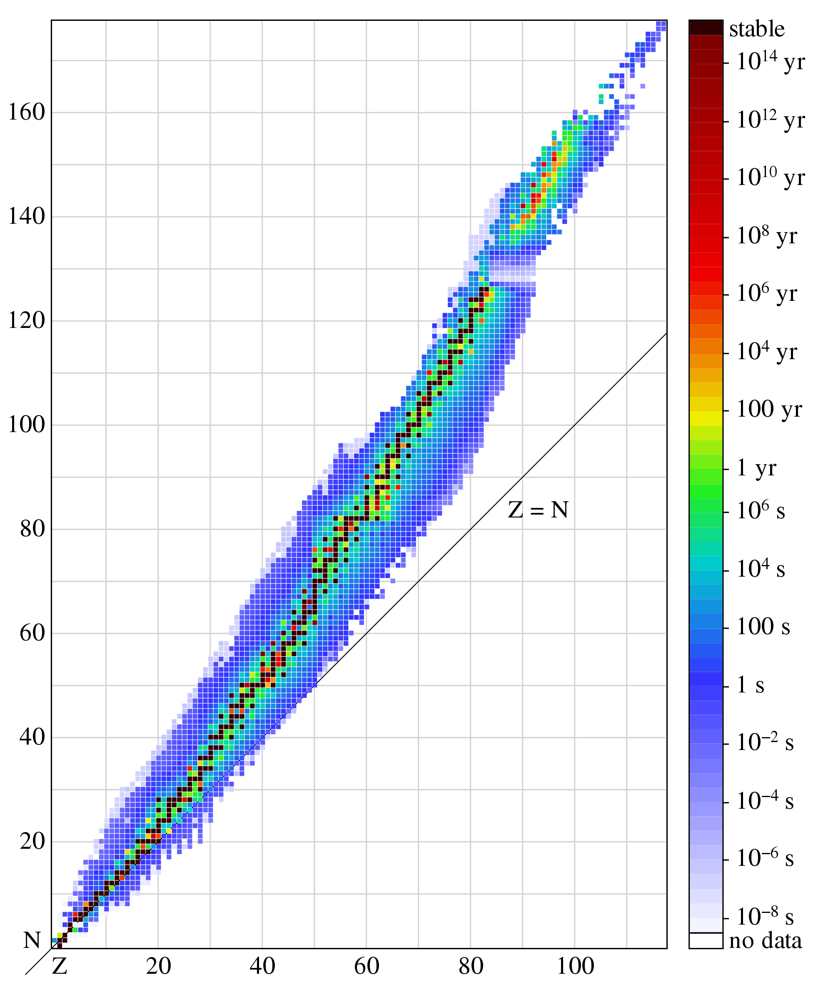
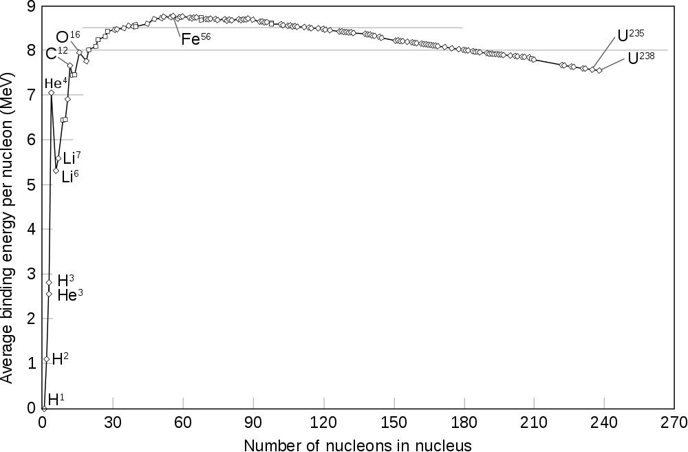

# Introduction {#introduction}

## Physics constants {#constant}

The constants are available from the [here](http://physics.nist.gov/cuu/Constants/) supported by National Institute of Science and Technology (NIST). 

The important __constants__ used in medical physics are:

* Avogadro constant: $N_A = 6.022\times10^{23} mol^{-1}$
* Speed of light in vacuum: $c = 2.998\times10^8\ m/s$
* Atomic mass constant: $u = 1.661 \times 10^{−27}\ kg = 931.5\ MeV/c^2$
* Elementary charge: $e = 1.602 \times 10^{−19}\ C$
* Electron rest mass: $m_e = 9.109 \times 10^{−31}\ kg = 0.5110\ MeV/c^2$
* Proton rest mass: $m_p = 1.673 \times 10^{−27}\ kg = 1.007\ u = 938.3 MeV/c^2$
* Neutron rest mass: $m_n = 1.675 \times 10^{−27}\ kg = 1.009\ u = 939.6 MeV/c^2$
* Planck constant: $h = 6.626 \times 10^{−34}\ J\cdot s = 4.136 \times 10^{−15}\ eV\cdot s$

The SI system of units

The __7 base quantities__ and their units are

* Length: meter (m)
* Mass: kilogram (kg) 
* Time: second (s)[^si-second]
* Electric current: ampere (A)
* Temperature: kelvin (K)
* Amount of substance: mole (mol)
* Luminous intensity: candela (cd)

[^si-second]:
The SI standard: 1 second is defined to be exactly 9,192,631,770 cycles of a Caseium [atomic clock](https://en.wikipedia.org/wiki/Atomic_clock) (a hyperfine transition/decay with wavelength of 3.26 cm). As long as you can count this large number accurately, the accuracy fo this type of atomic clock is about $10^{-10}$ ($\approx 1/9,192,631,770$). 

## Atomic Representation {#atomic-rep}

Atoms = Nucleus (neutron and protons)[^rutherford] + Orbital electrons[^bohr]

$$^A_ZX$$

* A (mass number) - the number of protons and neutrons
* Z (atomic number) - the number of proton number
* X (chemical element) - for the element

Atomcs can be classified in terms of the **same** number of protons, neutrons, mass, and (meta)state.

* Isoto**p**e - same number of **p**rotons
* Isoto**n**e - same number of **n**eutrons
* Isob**a**r - same **a**tomic number
* Iso**m**er - same A, Z, N but different energy meta-states; eg $_{43}^{99m}Tc$ is in metastable[^metastable] state and $^{99}_{43}Tc$ is in stable state)

## Stability

The stability depends on the ratio of neutron and proton (see Figure \@ref(fig:stability))


```{r echo=FALSE, warning=FALSE, stability, fig.align='center', out.width='80%', fig.cap="Stability of isotopes"}

```

## Mass Defect {#mass-defect}

The mass of an atomic nucleus is less than the sum of the individual masses of the free constituent protons and neutrons. This “missing mass” is known as the mass defect. 

<p class="FOO">What is the mass defect of a ^12^C atom? <br><br> It can be calculated by:
$6 \times m_p + 6 \times m_n + 6 \times m_e - m_{C} = 0.0988\ amu,$ where m~C~ = 12 amu (1 atomic mass unit is defined as 1/12 of the mass of an C-12 atom). The complete list of mass number can be found in the [NIST database](https://physics.nist.gov/cgi-bin/Compositions/stand_alone.pl). Ingoring the electron masses is acceptable.</p>

The mass defect is closed related to <span style="color:Salmon">nuclear binding energy</span>. If we divide the above energy by 12 and times 931.5 MeV/amu, we obtain the bind energy per neucleio for ^12^C is 7.67 (see Figure \@ref(fig:binding)) 

```{r echo=FALSE, warning=FALSE, binding, fig.align='center', out.width='80%',fig.cap= 'Nuclear binding energy per nucleon (The image is from wiki)'}

```

A complete table of nuclear bind energies can be found on Lawrence Berkeley National Laboratory [(link)](http://xdb.lbl.gov/Section1/Table_1-1.pdf).

## High energy charged particles {#einstein}

The energy of a moving particle (not a photon) depends on its velocity $\upsilon$ and its rest mass $m_0$.

\begin{equation}
    E = mc^2 = \frac{m_0c^2}{\sqrt{1-\frac{\upsilon^2}{c^2}}}.
    (\#eq:emc2)
\end{equation}

The energy can also be expressed as:
\begin{equation}
    E = E_{0}+E_{K.E.},
    (\#eq:total-E)
\end{equation}
where E~0~ and E~K.E.~ are the rest energy and kinetic energy (K.E.) of a particle.

<p class="FOO">What is the velocity of an electron with a kinetic energy of 2 MeV? <br><br>
Using Eq. \@ref(eq:emc2) and \@ref(eq:total-E), 0.511 MeV + 2 MeV = 0.511  MeV/${\sqrt{1-\frac{v^2}{c^2}}} \rightarrow v \approx$ 0.96 c. Similarly, you can find that to accelerate a proton to the velocity of 0.96 c, the kinetic energy will be about **2,400 MeV**, i.e., you need give much more energy to accelerate protons to the speed close to the speed of light (proton machine is much larger).
</p>

## High energy photons {#high-E-photon}

**Wave-particle duality**

The energy of a photon **particle** is given by

\begin{equation}
    E = h\times v,
    (\#eq:frequency)
\end{equation}
where h is the Planck constant ([Physical constants](#constant)), $v$ is the frequency in unit of s^-1^ or Hertz.

The energy can also be written in the form of electromagnetic **waves**
\begin{equation}
    E\ (eV) = \frac{1,240}{\lambda\ (nm)}, 
    (\#eq:wavelength)
\end{equation}

<p class="FOO"> What are the wavelength and frequency of a 2 MeV photon? <br><br>Using Eq. \@ref(eq:frequency) and $v=\frac{E}{h}=\frac{(2\times10^6\ eV) \cdot (1.6 \times 10^{-19} J/eV)}{6.626\times 10^{-34}J\cdot s}$ = $4.8 \times 10^{20}$ Hertz. Using Eq. \@ref(eq:wavelength), the wavelength of a 2 MeV photon is $\frac{1240}{2\times 10^{6}\ eV} = 6.2 \times 10^{-4}$ nm. It is much samller than the size of an atom (**0.1 nm**) or that of DNA (**2.5 nm**). The size of a hydrogen nuclei is about 1.76 $\times$ 10^-6^ nm</p>

## Electron Shell

- <span style="color:Salmon"> Principle </span> quantum number ($n = 1, 2, 3, ...$ or K, L, M, ...)  – the main energy level (or shell) occupied by an electron. The energy can be calculated by$$E_n=\frac{Z^2{\hbar}^2}{2m_0\alpha^2_Bn^2},$$ where $\alpha_B$ is the <span style="color:Salmon">Bohr radius </span> (= 5.29 $\times$ 10^-11^ m). The __K shell__ (binding) energy for Lead, Tungsten, and Carbon are 88 KeV, 69.5 KeV, and 0.28 KeV. 
- <span style="color:Salmon"> Secondary </span> quantum number ($l = s, p, d, ...$)  – the energy sublevel (angular monentum) occupied by the electron.
- <span style="color:Salmon"> Magnetic </span> quantum number ($m_l = -l, -l+1, ..., 0, ..., l-1, l$) – the number of possible orientations (projections) for each of energy sublevels.
- <span style="color:Salmon"> Spin </span> quantum number ($m_s=-1/2, 1/2$) – the two possible orientations that an electron can have in the presence of a magnetic field.

**Solutions**

`Q1: a), c), (e)` see Sec. \@ref(atomic-rep)  
`Q2: b), d); a) is wrong because they are isotopes; c) is wrong because they are isobars.`  
`Q3: a), b), and c)` see Fig. \@ref(fig:binding)  
`Q4: `  
`Q5: b), c); a) should be 6 neutrons and d) should be 12 times 931 MeV.`  
`Q6: a)` see Sec. \@ref(mass-defect) example  
`Q7: b)` see Eq. \@ref(eq:total-E)  
`Q8: d)` see Sec. \@ref(einstein)  
`Q9: c)` see Sec. \@ref(high-E-photon) example  
`Q10: a)` see next chapter  
`Q11: b)`    
`Q12: a), b), c), e)`  Four fundamental types of forces in order of increasing strength: <span style="color:Salmon">gravitational</span>, <span style="color:Salmon">EM</span> (e.g. Coulomb scattering of electrons), <span style="color:Salmon">weak</span> (e.g. beta decay), and <span style="color:Salmon">strong</span> force (e.g. Bremsstrahlung and mutual attractions of necleons).   
`Q13: b), c)`  
`Q14: c)` use Eq. \@ref(eq:wavelength) for Q14, Q15, and Q16
`Q15: b)`   
`Q16: c)` 

[^metastable]:
Metastabe state is an excited state of an atom that has a longer lifetime than the ordinary excited states but generally has a shorter lifetime than the lowest, often stable, energy state, called the ground state. [britannica](https://www.britannica.com/science/metastable-state) 

[^rutherford]:
Rutherford interpreted the results of the [gold foil experiment or Geiger-Marsden experiment](https://en.wikipedia.org/wiki/Geiger%E2%80%93Marsden_experiment) and established the Rutherford model of atom, which constitutes a tiny ($10^{-15}$ m), heavy nucleus which consists of protons and/or neutrons. He also won [the Nobel Prize in Chemistry 1908](https://www.nobelprize.org/nobel_prizes/chemistry/laureates/1908/) “for his investigations into the disintegration of the elements, and the chemistry of radioactive substances”. He discovered three types of radiation: $\alpha$, $\beta$, and later $\gamma$ radiation. 

[^bohr]:
In 1913, Bohr proposed a theory for the hydrogen atom based on __quantum theory__ that (a) electrons orbit around the nucleus; (b) electrons orbits at a certain discrete set of distances from the nucleus without radiation and energy loss; (c) electrons can only gain and lose energy by jumping from one allowed orbit to another, absorbing or emitting electromagnetic radiation with a frequency: $v=\frac{E_m-E_n}{h}$. He won [the Nobel Prize in Physics 1922](https://www.nobelprize.org/nobel_prizes/physics/laureates/1922/).

[^amu]:
atomic mass unit; 1/12 mass of $_6^{12}\textrm{C}$ atom in quantity; $1amu = 1.66 \times 10^{-27} kg$ or **931.5** MeV.
