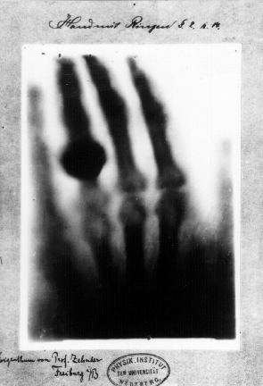
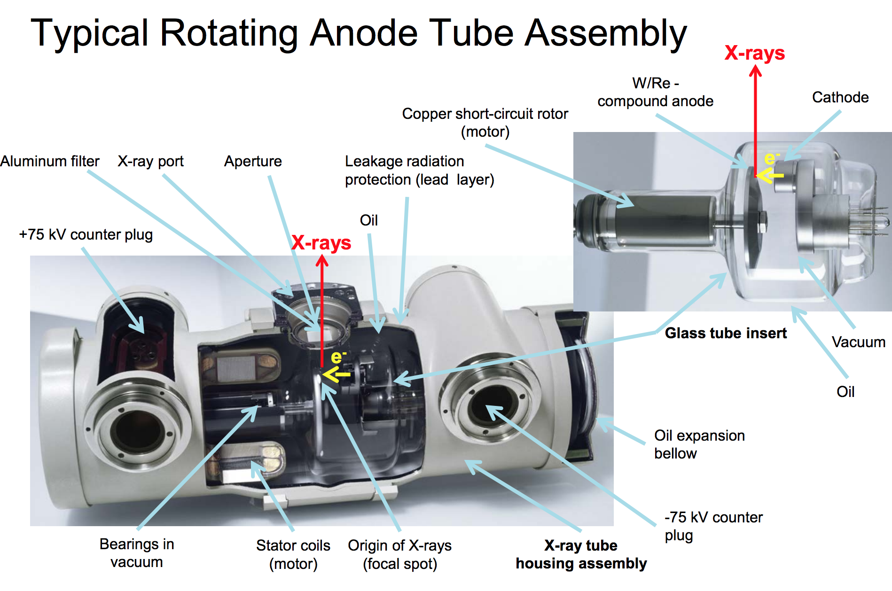
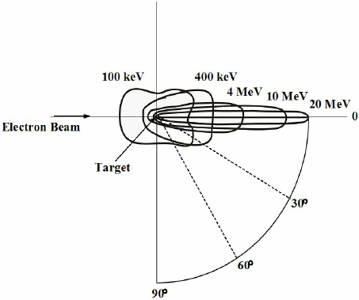
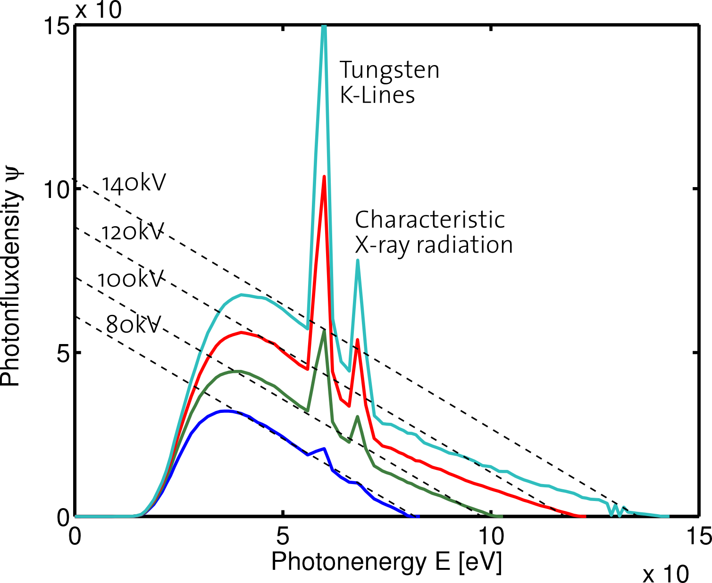

# Production of X-rays {#prox}

## History

- Cathod-ray tube (for example, Crookes tube)^[partially vaccum and low voltage; think about neon lighting; see [wiki](https://en.wikipedia.org/wiki/Crookes_tube)]. 
- 1895-11-08, Wilhelm Rontgen discovered x-ray by observing fluorsece when applying high volotage (using an induction coil) on a board-covered Crookes tube ([wiki](https://en.wikipedia.org/wiki/Wilhelm_Röntgen) and [The Laureates: William Roentgen](https://www.youtube.com/watch?v=qVn3mgt8Two).
- Coolidge developed the <font color="Salmon">hot cathode</font> x-ray tube in 1913, in which a wire filament was heated with electrical current to release electrons by the process of <font color="Salmon"> thermionic emission</font>. This was the first major breakthrough as cathod-ray tubes cannot generate reliable and high-intensity x-ray. 
- The next major breakthrough in x-ray tube design was the **rotating anode**, which was developed by Albert Bouwers in 1930.
- Other minor improvements include metal ceramics (replacing glass), liquid bearing (replace ball bearing), and etc.

```{r echo=FALSE, warning=FALSE, hand, fig.align='center', out.width='30%', fig.cap="First medical X-ray by Wilhelm Röntgen of his wife Anna Bertha Ludwig's hand. (The image is from [wiki](https://en.wikipedia.org/wiki/Wilhelm_Röntgen))"}


```

> **The Coolidge tube was the prototype for x-ray tubes in use today.**

## Conventional x-ray tubes

The basic components of a useful x-ray tube include: (a) electron source (cathod), (b) high voltage supply, (c) target (anode) for x-ray production, (d) vacuum, and (e) collimator. 

```{r echo=FALSE, warning=FALSE, x-raycomponents, fig.align='center', out.width='80%', fig.cap="X-ray tube components (From Rolf Behling's [talk](http://amos3.aapm.org/abstracts/pdf/113-31203-379492-117965-693976871.pdf) at 2017 AAPM Spring Meeting.)"}


```
### Electron Source (Cathode)

- Thermonic emission
$$
J = \text{const.} \times T^2 \times \text{exp}(-e\psi/kT)
$$
- The filament is housed within a negatively charged focusing cup.
- With high voltage applied across the tube, thermonic electrons are attracted to the target (anode) without electrons pile-up around the filement. In this scenerio, the tube is operated in the mode of <font color="Salmon">filament-emission limited</font>. 
- With lower voltage applied across the tube, thermonic electrons are not pulled immediately to the target. The accumulated electrons (or space charge) will prevent additional electrons leaving the filament and therefor limit the tube current. Under this condition, the tube is operated in the mode of <font color="Salmon">space-charge limited</font> (e.g. mammography machine).
- Dual-focus x-ray tube

### High voltage

The electric potential difference (voltage) between the filament (cathode) and target (anode) of an x-ray tube affects the x-ray output, **intensity** (see electron source part) and spectrum of x-ray.

- State of art: high-frequency x-ray generators (1-100 kHz) - three-phase AC to almost DC
- What is kVp? It stands for maximum or peak volotage. Accodring to [wiki](https://en.wikipedia.org/wiki/Peak_kilovoltage), kVp controls the property called "radiographic contrast" of an x-ray image. The quantity mA$\cdot$s is the primary controlling factor of radiographic density (# of photons), where mA is the <font color="Salmon">tube current</font> (the current generated in the electron beam) and s is the exposure time. Compared to the tube current (e.g. 1 mA in fluoroscopy to over 1,000 mA in angiography), the <font color="Salmon">filament (supply) current</font> is quite large (e.g. 5 A), depending on the efficiency of the thermionic emission.

The x-ray output is **linearly propotional** to (kVp)^2^, mA, the filament current (A).

### Target for x-ray production

X-ray production is the result of <font color="Salmon">Bremsstrahlung</font> (braking radiation). The conversion efficiency from electrons to useful x-ray photons is only about **0.1%**. This is due to low Bremsstrahlung efficiency ($\approx$ **9 $\times$ 10^-10^ ZV**) and only the small portion of x-ray (of all 4$\pi$ space) used (see Fig. \@ref(fig:x-raydistributions)). Most of high energy electrons will be wasted by generating **heat** in the target. Many design considerations are based on avoiding overheat such as rotating anode and the use tungsten material due to its high melting point of about 3,400 ^o^C.

```{r echo=FALSE, warning=FALSE, x-raydistributions, fig.align='center', out.width='50%', fig.cap="The spatial distribution of x-ray generated around a thin target"}


```

### Target X-ray spectra

The x-ray spectrum shows characteristic x-rays[^charac] superimposed with the **continuous** distribution of energies for the bremsstrahlung photons, with low energy part removed by x-ray tube enclosure.

[^charac]:
Characteristic x-rays in x-ray tube is released as follows: (1) a high energy electron ejects K shell electron; (2) a L or M shell electron jumps to the empty K shell; (3) a photon is emitted with energy of E~K~-E~L~ ($K_\alpha$; $\alpha$ means nearby transition) or E~K~-E~M~ ($K_\beta$). Characteristic x-rays can also be produced following a photoelectric photon
interaction (incident photon ejects electron rather than incident electron)

```{r echo=FALSE, warning=FALSE, x-rayspectrum, fig.align='center', out.width='60%', fig.cap="The spectrum of x-ray spectrum from a tungsten target (copyright@[Dr. P. Cattin](https://miac.unibas.ch/PMI/01-BasicsOfXray.html#(1)))"}


```

**Solutions**

`Q1: b)`   
`Q2: c)`   
`Q3: a)`  
`Q4: c)`  
`Q5: b), c), d)`  
`Q6: b), e)`  
`Q7: c)`  
`Q8: c)` see Section \@ref(einstein)  
`Q9: b), d)`   
`Q10: a), b), d)`   
`Q11: b)`    
`Q12: e)`    

