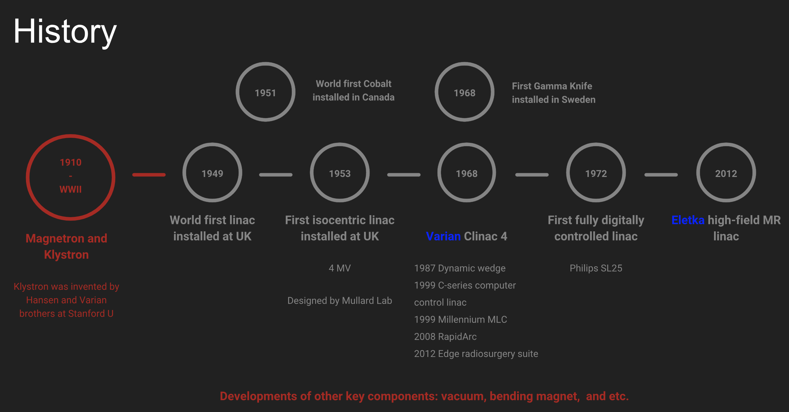
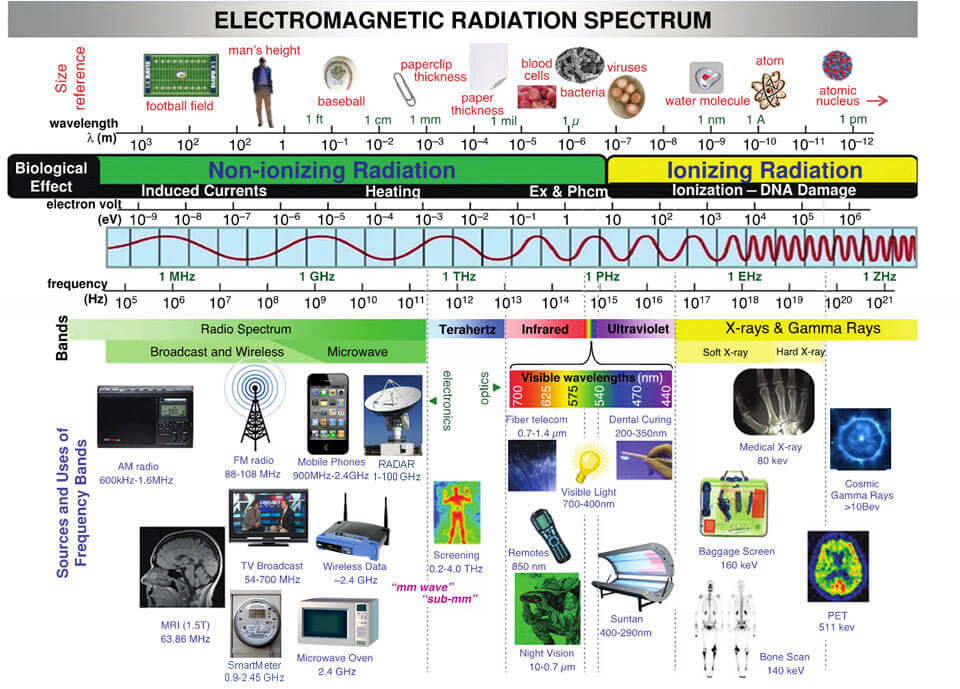
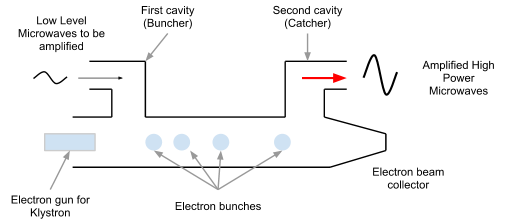
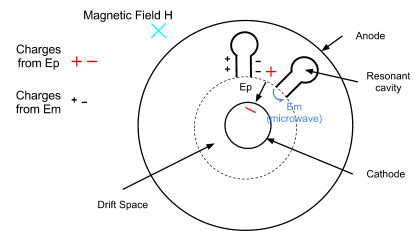
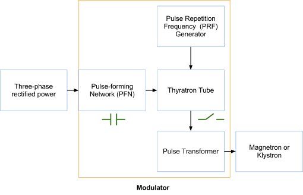
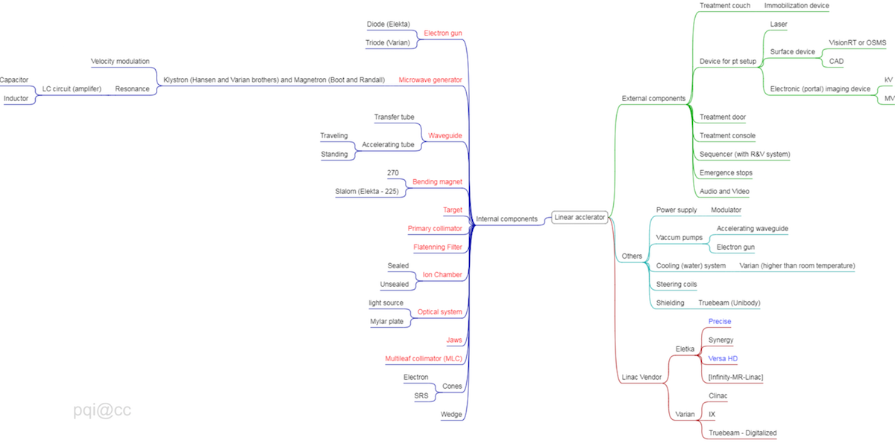

# Clinical Treatment Generators {#gene}

This chapter will be focused on **microwave electron linear accelerator** (linac). Other machines are or were also widely used for clinical treatmenet, including Cyclotron (E.O. Lawrence 1932), Betatron (D.O. Kerst 1940), Cobalt machine, Gamma Knife (Lars Leksell 1968), and etc. 

## History

The developement of linac can be seen in figure below.

```{r echo=FALSE, message=FALSE, warning=FALSE, fig.align='center', fig.cap="History of linac design."}

```

## Components

The **principles** of how a linac works are:

1. Electrons are emitted from an electron gun (Sec. \@ref(egun)) from a hot cathode, are accelerated by pulsed kilovoltage (~ 50 keV), pass through a hole in an anode, and enter an acclerating waveguide.
2. Electrons ride microwave down an accelerating waveguide (Sec. \@ref(waveguide)), to which high power microwave is fed from a microwave amplifier (Sec. \@ref(mvamp)), a magnetron or a klystron.
3. High energy electrons leaves the waveguide and pass through bending magnet (Sec. \@ref(bending)) assembly to become more focused and near mono-energetic. 

The major componenets of a linac can be seen in figure below.

```{r echo=FALSE, message=FALSE, warning=FALSE, fig.align='center', fig.cap="a simple schematic of a linear accelerator"}
knitr::include_graphics("figures/linac_components.png")
```

### Electron gun {#egun}

Varian and Elekta have their own design for electron gun: Triode and diode. 

```{r echo=FALSE, message=FALSE, warning=FALSE, fig.align='center', out.width='40%', fig.show='hold', fig.cap="Varian (left) and Elekta (right) electron gun. The snapshot images are taken from [here](http://eecue.com/p/29719/Electron-Gun.html) and [Lamp adn tube museum](http://lampes-et-tubes.info/sp/sp168.php?l=f)."}

knitr::include_graphics(c("figures/linac_gun_varian.png","figures/linac_gun_elekta.png"))
```

### Microwave amplifier{#mvamp}

> VELOCITY MODULATION + RESONANCE

The microwave is one type of electromagnetic waves with frequncy ranging from 300 MHz to 300 GHz and wavelength from 1 m to 1 mm. 

```{r echo=FALSE, message=FALSE, warning=FALSE, out.width='80%', fig.align='center', fig.cap="Electromagnetic specturm (the image is download from [here](https://www.defendershield.com/safe-levels-electromagnetic-radiation/))."}

```
Microwave frequency in most medical linear accelerators is about **3 GHz** (2,856 MHz in exact), which falls into the category of IEEE **S-band** (2-4 GHz, Wiki). The Mobetron and Cyberknife machines use higher frequency (8-12 GHz, categorized as in IEEE **X band**, for compact design (Hanna 1999 [Applications of X-band Technology in medical accelerators](https://accelconf.web.cern.ch/AccelConf/p99/PAPERS/WEP114.PDF)).

#### Klystron

The possibly best simple explanation about how a [klystron](https://www.youtube.com/watch?v=Fvud81pYGOg) amplifier and [microwave oscillators](https://www.youtube.com/watch?v=VkpEQZEGSkE&t=108s) work can be found on YouTube.  

A Klystron is a microwave amplifier tube that makes use of two (or more for better bunching result) resonant cavities. For a simple two cavity Klystron,  

1. The first resonance cavity is energized by very low-power microwaves through a coaxial cable.
2. The microwave will cause alternating “E” fields across the gap between left and right cavity wall.
3. As the electrons from the accelerated through the first cavity, half of them will be decelerated and the other help will accelerate (<font color="Salmon">velocity modulation</font>), and thus form electron bunches as they drift towards the second cavity.
4. The Catcher cavity is resonant at the arrival frequency of the bunch.
5. This will generates a retarding “E” field for slowing down electrons and in turn the electrons give their energies in the form of high-power microwaves (more electrons in a bunch $\rightarrow$ more kinetic energy $\rightarrow$ more EM energies induced in the 2nd resonant cavity).   

```{r echo=FALSE, message=FALSE, warning=FALSE, fig.align='center', fig.cap="how a klystron works"}

```

#### Magnetron

A Magnetron is a device that produces and amplifies microwave.

1. The electrons emitted from the heated cathode are accelerated by the pulse electric field, EP, toward the anode across the evacuated drift space between cathode and anode.
2. A static magnetic field, H, is applied perpendicular to the cross section of the device.
3. The accelerated electrons induce an additional charge distribution shown on the anode poles and an electric field Em of microwave frequency between adjacent segments of the anode (similar to that in the catcher cavity of the klystron). 

```{r echo=FALSE, message=FALSE, warning=FALSE, fig.align='center', fig.cap="how a magnetron works"}

```

The comparison between a klystron and a magnetron can be seen in Table \@ref(tab:klystron-magnetron-comp).

```{r echo=FALSE, message=FALSE, warning=FALSE, klystron-magnetron-comp}
a = c("Complicated", "Simple")
b = c("up to 7.5 MW", "up to 3 MW")
c = c("~55%", "lower efficiency")
d = c("10,000 hours", '5,000 hours')
e = c("Varian", 'Elekta')

temp = rbind(a, b, c, d, e)

colnames(temp) <- c("Klystron", "Magnetron")
rownames(temp) <- c("Construction", "Power", "Efficiency", "lifetime", "Manufacture")

temp <- as.data.frame(temp, stringsAsFactors = F)

library(knitr)
library(dplyr)
library(kableExtra)
library(stringr)

kable(temp, escape = F, caption = 'Comparsion of a klystron and a magnetron') #%>%
#scroll_box(width = "100%", height = "400px")
```
### Waveguide {#waveguide}

Waveguides are evacuated or gas filled metallic structures of rectangular or circular cross-section used in transmission of microwaves.

Two types of waveguide:

- RF power transmission waveguides (gas filled, sulfur hexafluoride SF6) for transmission of the RF power from the power source (Magnetron or Klystron) to the accelerating waveguide.
- Accelerating waveguides (evacuated to about 10^-6^ torr `1 torr ~ 1 mmHg`) for acceleration of electrons
    * Travelling
    * Standing

### Bending magnet {#bending}

Because velocities (energies) of electrons exiting the accelerating waveguide are not the same, the bending magnet is used to make electrons more mono-energetic when it reaches the (photon) target or (electron) scattering foil. 
```{r echo=FALSE, message=FALSE, warning=FALSE, fig.align='center', out.width=c('40%', '80%'), fig.show='hold', fig.cap="Varian (upper) and Elekta (lower) design of bending magnet. The snapshot images are taken from Karczmark - Medical Linar Accelerators."}

knitr::include_graphics(c("figures/linac_bm_varian.png","figures/linac_bm_elekta.png"))
```

### Primary collimator

### Target carousel

### Ion chamber

### Jaws and MLCs

### Auxiliary system 

**Vacuum** see \@ref(waveguide)

**Cooling**

The (default) cooling temperature is quite different for Varian and Elekta linear acclerators, which are about 22^o^C and 40^o^C, respectively.  

The klystron or magnetron and target need to be cooled using the cooling system. 

**Modulator**

Modulator converts DC voltage nto high-voltage DC pulses of a few $\mu$s in duration. It contains several major components including PFN, PRF (on an Elekta Synergy machine, you may see PRF error often if soemthing else goes wrong.), a thyratrion switch. 

```{r echo=FALSE, message=FALSE, warning=FALSE, fig.align='center', fig.cap="Components of modulator."}

```


## Penumbra {#penumbra}

The term <font color="Salmon">penumbra</font> means the region, at the edge of a radiation beam, over which the dose (rate) changes (80% to 20% - relative to c.a.x. dose) rapidly as function of lateral distance. The overall penumbra was contributed from three sources:

- <font color="Salmon">Geometric</font> penumbra is caused by the source (or focal spot) having a finite size and the location of the collimator. It can be reduced by decreasing the focal spot and move the collimator closer to the patient (e.g. Varian tertiary MLC).
- <font color="Salmon">Transmission</font> penumbra is caused by photons transmitted through the edge of the collimator. It can be reduced by aligning the collimator following the beam divergence (e.g. X and Y photon jaws).
- <font color="Salmon">Physical (total)</font> penumbra is the combination of transmission, geometric penumbra, and lateral scatter of radiation (photon and electrons) within the patient. Lateral electron disequilibrium (# of electrons projected laterally outward is not equal to # of electrons projected laterally inward). Because the range of these laterally projected electrons increases as energy increases, higher energy beams have a slightly greater penumbra than low energy beams.

```{r echo=FALSE, message=FALSE, warning=FALSE, fig.align='center', fig.cap="Mindmap of a modern linac."}

```

**Solutions**

`Q1: a), b), c)`   
`Q2: c), d)`   
`Q3: a), c)`  
`Q4: d)`  
`Q5: c)`  
`Q6: a), b)`  
`Q7: a), c), d)`  see Sec. \@ref(penumbra)  
`Q8: d)`  
`Q9: c)`   
`Q10: c), e)`   
`Q11: e)`    
`Q12: c)`  
`Q13: c)`   
`Q14: c)`    
`Q15: b), c)`
