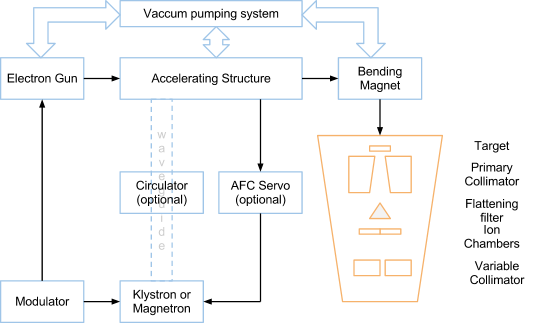
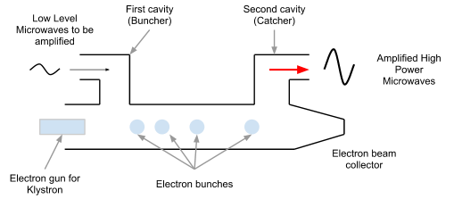

# Clinical Treatment Generators {#gene}

## History

* `Cyclotron` Earnest O. Lawrence 1932
* `Betatron` Donald W. Kerst 1940
* `Cobalt machine`
* `Linear accelerator` 1950s
* `Gamma knife` Lars Leksell 1968

## Waveguide
```{r echo=FALSE, message=FALSE, warning=FALSE, fig.align='center', fig.cap="a simple schematic of a linear accelerator"}

```


## Microwave amplifier  

The possibly best simple explanation about how a [klystron](https://www.youtube.com/watch?v=Fvud81pYGOg) amplifier and [microwave oscillators](https://www.youtube.com/watch?v=VkpEQZEGSkE&t=108s) work can be found on YouTube.  

A `Klystron` is a microwave (300 MHz – 300 GHz) amplifier tube that makes use of two (or more for better bunching result) resonant cavities. For a simple two cavity Klystron,  

1. The first resonance cavity is energized by very low-power microwaves through a coaxial cable.
2. The microwave will cause alternating “E” fields across the gap between left and right cavity wall.
3. As the electrons from the accelerated through the first cavity, half of them will be decelerated and the other help will accelerate (velocity modulation), and thus form electron bunches as they drift towards the second cavity.
4. The Catcher cavity is resonant at the arrival frequency of the bunch.
5. This will generates a retarding “E” field for slowing down electrons and in turn the electrons give their energies in the form of high-power microwaves (more electrons in a bunch $\rightarrow$ more kinetic energy $\rightarrow$ more EM energies induced in the 2nd resonant cavity).   

```{r echo=FALSE, message=FALSE, warning=FALSE, fig.align='center', fig.cap="how a klystron works"}

```

A `Magnetron` is a device that produces microwaves.  

1. The electrons emitted from the heated cathode are accelerated by the pulse electric field, EP, toward the anode across the evacuated drift space between cathode and anode.
2. A static magnetic field, H, is applied perpendicular to the cross section of the device.
3. The accelerated electrons induce an additional charge distribution shown on the anode poles and an electric field Em of microwave frequency between adjacent segments of the anode (similar to that in the catcher cavity of the klystron). 

```{r echo=FALSE, message=FALSE, warning=FALSE, fig.align='center', fig.cap="how a magnetron works"}
knitr::include_graphics("figures/magnetron.png")
```

## Microwave frequency 

The microwave pulse frequency in most medical linear accelerators is about **3 GHz**, which falls into the category of IEEE `S-band` (2-4 GHz, Wiki). The Mobetron and Cyberknife machines use higher frequency (8-12 GHz, categorized as in IEEE `X band`, for compact design (Hanna 1999 [Applications of X-band Technology in medical accelerators](https://accelconf.web.cern.ch/AccelConf/p99/PAPERS/WEP114.PDF)). 

## Penumbra 

The term `Penumbra` means the region, at the edge of a radiation beam, over which the dose rate changes rapidly as function of lateral distance. The overall penumbra was contributed from three sources: 

* _Geometric penumbra_ is caused by the source (or focal spot) having a finite size and the location of the collimator. It can be reduced by decreasing the focal spot and move the collimator closer to the patient (e.g. Varian tertiary MLC).
* _Transmission penumbra_ is caused by photons transmitted through the edge of the collimator. It can be reduced by aligning the collimator following the beam divergence (e.g. X and Y photon jaws).
* _Physical (total) penumbra_ is the combination of transmission, geometric penumbra, and lateral scatter of radiation (photon and electrons) within the patient. Lateral electron disequilibrium (# of electrons projected laterally outward ≠ (# of electrons projected laterally inward). Because the range of these laterally projected electrons increases as energy increases, higher energy beams have a slightly greater penumbra than low energy beams.
