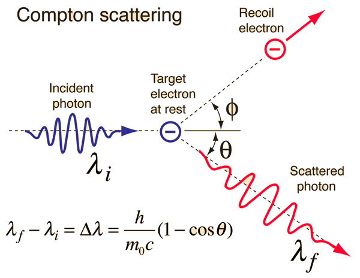

# Interaction {#inter}

> Follow the energy

## Photon beam attenuation

**Attenuation** of radiation is removal of photons or energy from a beam by **different interactions** including absorption and scatter. Like the process of radioactive decay, the attenuation is also a stochastic process.

For a thin absorber, with absorber far away from the source (so effect of beam divergence or inverse square law can be negligible)[^faraway] or in a **narrow** beam geometry, we get: 

[^faraway]:

The intensity of a point radiation source follows inverse square law. This a kind of geometric concept as the area of a sphere is $A = 4\pi r^2$. The inverse square law is valid under two assumptions: (1) point source, i.e. small enough compare to distance; (2) photon undergoes no interaction (e.g. TBI with spoiler).

\begin{equation}
    -\frac{\Delta N}{N} = \mu \Delta x,
    (\#eq:linear-attenuation)
\end{equation}
where $\mu$ is <font color="Salmon">linear attenuation coefficient</font> which can be thought as the fraction of photons or energy removed from beam per cm of absorber beam per cm. 

Half-value layer (HVL) relates to the linear attenuation coefficient by
\begin{equation}
    HVL = \frac{0.693}{\mu}
    (#eq:hvl)
\end{equation}

<font color="Salmon">Mass attenuation coefficient</font> is often used to remove the dependence of the physical density.

\begin{equation}
\left(\frac{\mu}{\rho}\right) \propto \frac{\sigma_{tot}}{\rho} =  \frac{\sigma_{coh}}{\rho}+\frac{\sigma_{pe}}{\rho}+\frac{\sigma_{comp}}{\rho} + 
\frac{\sigma_{pair}}{\rho} + \frac{\sigma_{trip}}{\rho} + \frac{\sigma_{ph.n}}{\rho}
(\#eq:mass-attenuation)
\end{equation}

### Photoelectric interactions {#photo-el}

- The probability[^cross] of photoelectric interaction $\propto$ $\frac{Z^3}{E^3}$;
- Incident photon interact with bound atomic electron;
-  **All** energy is given to electron;
- An orbital electron is ejected possessing most of incident photon, and a vacancy is present;
- Characteristic x-ray and <font color="Salmon">Auger</font> electron (The energy released by the downward transition is given to one of the outer electrons instead of to a photon).

### Compton interactions {#compton}

- The probability of Compton interaction $\propto {\rho_e}$.
- Interaction between incident high energy photons and loosely bound orbital electrons.
- The energy of the scattered photon are (with $\alpha={hv_i}/{m_ec^2}$ and $\theta$ is the angle between incident and scattered photon)

\begin{equation*}
  E_{p_f} = hv_i\frac{1}{1+\alpha(1-\cos\theta)}.
\end{equation*}

- the wavelength change of the scattered photon from the incident photon is:
    
\begin{equation*}
    \lambda_f = \lambda_i + \frac{h}{mc^2}(1-cos\theta)
\end{equation*}

```{r echo=FALSE, warning=FALSE, fig-compton, fig.align='center', out.width='60%',fig.cap= 'Illustration of Compton scattering. (The image is taken from http://hyperphysics.phy-astr.gsu.edu/hbase/quantum/compton.html)'}

```

```{block, type='FOO'}
*What is the energy of the scattered photon existing perpendicularly from the indicent high energy photon from a linac?*

For high energy photons, 
$$E_{p_f} = hv_i\frac{1}{1+\alpha} \overset{\alpha\gg1}{\longrightarrow} hv_i\frac{1}{\alpha} \approx 0.5 \ MeV$$

- with $\theta = 0^o$ (glazing hit), almost no energy loss for the photon and the electron acquires minimum energy;
- with $\theta = 180^o$ (photon is scattered back), the energy of the scattered photon $hv_i \times \frac{1}{1+2\alpha} \approx 0.25$ MeV) and the electron gain maximum energy.
```
    
### Pair production {#pair}

- The probability of pair production $\propto$ $Z\cdot E$.
- Occurs when a photon approaches closely enough to the target nucleus;
- The incident photon energy may be converted directly into an electron-positron pair. When the positron comes to rest, it combines with an electron, and both particles then undergo annihilation, with the appearance of two photons with energy of 0.511 MeV traveling in opposite directions.


## Charged particle interactions

[^cross]:
The basic quantity in collisional dynamics is <font color="Salmon">cross section</font>. The SI unit is $cm^2$ and the unit is `barn` ($1\ b = 10^{-24}\ cm^2$) in nuclear physics.


**Solutions**

`Q1: a), c)`   
`Q2: b)`   
`Q3: b)`  
`Q4: c), d)`  
`Q5: a)`  
`Q6: a), c), d)`  
`Q7: c)`  
`Q8: a)`  
`Q9: b), c), d)`   
`Q10: d)`   
`Q11: c)`    
`Q12: b)`  
`Q13: a), b), c), e)`   
`Q14: a), b), d)`    
`Q15: d)`  
`Q16: a)`