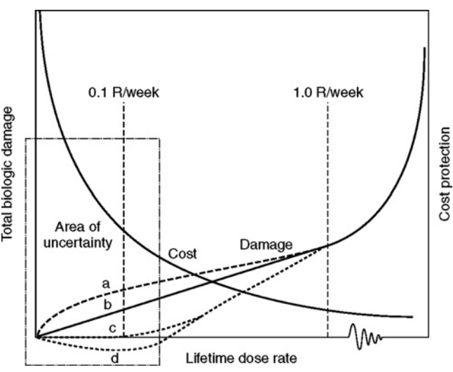
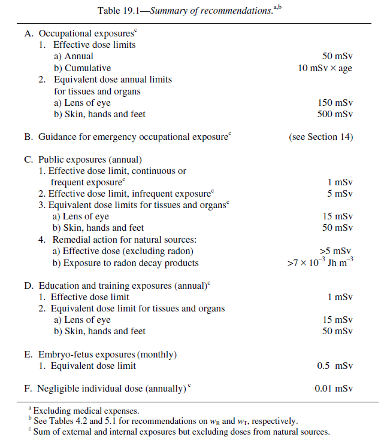
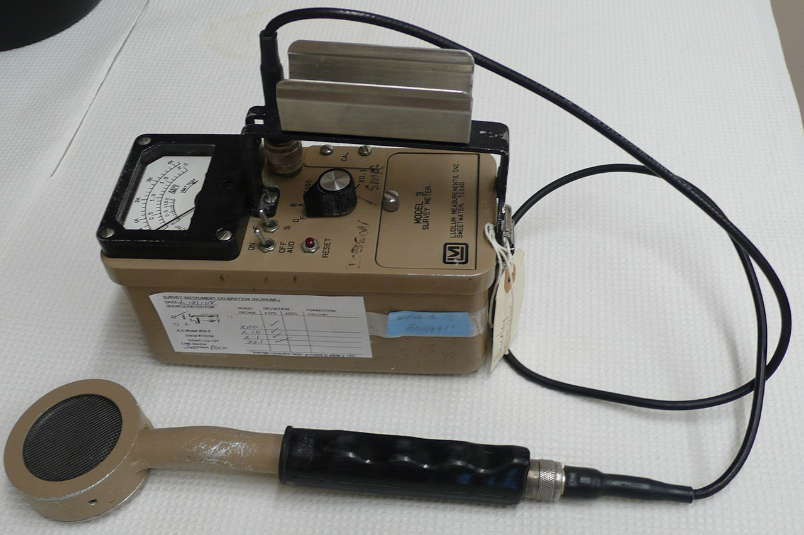

# Radiation Protection {#protection}

> Although radiation is naturally present in our environment, it can have either <font color="green">beneficial</font> or <font color="red">harmful</font> effect, depending on its use and control.
>
> `r tufte::quote_footer('--- NRC websit')`

## Biological Basis for Radiation Safety

The sensitivity of cells to irradiation is in direct proportion to their **reproductive** activity and inversely proportional to their **degree of differentiation**. 

### Linear non-threshold model of radiation injury

```{r echo=FALSE, warning=FALSE, lnt, fig.align='center', out.width='70%',fig.cap='Glaus W. The concept and philosophy of permissible dose to radiation (1958).'}

```

### Effects of radiation exposure

Exposure to ionizing radiation can produce several effects in an individual, depending on (1) the type and amount of radiation producing the exposure, (2) the fraction of the body that is exposed, (3) the general health of the exposed individual, and (4) the quality of medical care available in the event of a relatively high exposure. 

#### Stochastic (probabilistic) effects

Biological effects (such as carcinogenesis, teratogenesis, and mutagenesis) that appear several months or years after exposure to radiation have several characteristics in common: [^stochastic] 

[^stochastic]:
Precise estimates of the role of an initiating agent such as radiation in producing stochastic effects are difficult to obtain because the effects also occur in the absence of radiation. 

- The probability of occurrence of the effect (i.e., the number of persons in an exposed population who exhibit the effect) increases with dose;
- The severity of the effect in a single individual is unrelated to the magnitude of the dose (i.e., the effect is an “all or none” response); 
- No definitive threshold exists below which it can be said with certainty that the effect will not occur

#### Deterministic radiation effects

Deterministic effects are those effects that exhibit a dose threshold. Those acute effects, known as <font color="Salmon">acute radiation syndromes</font> (ARS), is an acute illness caused by irradiation of the **entire** body (or most of the body) by a **high dose** of penetrating radiation in a very **short** period of time (~minutes).  ARSs include:

- hematopoietic (bone marrow) syndrome (0. Gy to 10 Gy)
- gastrointestinal syndrome (> 10 Gy)
- cerebrovascular syndrome (> 50 Gy).

<p class="FOO"> 
*Which of the following is best described as a stochastic event? a) Skin erythema; b) Epilation (hair loss); c) Lens opacification; d) Tissue necrosis; e) None of the above*
</p>


## Sources of radiation exposure

According to the National Council on Radiation Protection and Measurement (NCRP) report 160 (2009), the average annual radiation dose per person in the U.S. is about 6.2 mSv, in which medical imaging contributes about 50% (e.g. CT: 24%, NM: 12%, interventional fluoroscopy 7%, conventional radiography 5%). Naturally occurring sources of radiation include cosmic radiation (5%), radioactive minerals in the ground and in your body (5%), and terrestrial radiation emitted by naturally occurring materials such as uranium, thorium, and radon (37%) in earth.

```{r echo=FALSE, warning=FALSE, dose-pie, fig.align='center', out.width='80%',fig.cap='The pie chart of sources of radiation exposure from NCRP 160 can be found [here](https://www.epa.gov/radiation/radiation-sources-and-doses).'}
knitr::include_graphics("figures/dose-pie-chart.png")
```

You would be exposed to about **0.035 mSv** (3.5 mrem) of cosmic radiation if you were to fly within the United States from the east coast to the west coast, which is still less than that from a chest x-ray.

<iframe width="100%" height="355" src="https://www.youtube.com/embed/uzqsnxZBLNE" frameborder="0" allow="accelerometer; autoplay; encrypted-media; gyroscope; picture-in-picture" allowfullscreen></iframe>

<p class="FOO">
*Estimate the radiation dose to a physicist during a breast IORT procedure.*
<br></br>
If the reading from survey meter is about 200 mR/hr and delivery time is half an hour, the radiation reaches the whole body (after lead apron ~ 0.5 mm thickness, it is about one TVL for x-ray with 50 kvp) will be about 10 mR which is about 0.1 mSv.
</p>

Personal Annual Radiation Dose Calculator from NRC could be found [here](https://www.nrc.gov/about-nrc/radiation/around-us/calculator.html).

## Dosimetric Quantities for Radiation Safety

> There are a number of reasons for the confusion. In part, it’s the usual disparity between standard metric units and the less-standard units favored in the United States, added to the general confusion of reporters dealing with a fast-changing situation (for example, some early reports mixed up microsieverts with millisieverts — a thousandfold difference in dose). Others are more subtle: The difference between the raw physical units describing radiation emitted by a radioactive material (measured in units like curies and becquerels), versus measurements designed to reflect the different amounts of radiation energy absorbed by a mass of material (measured in rad or gray), and those that measure the relative biological damage in the human body (using rem and sieverts), which depends on the type of radiation.
>
> `r tufte::quote_footer('--- [Explained: rad, rem, sieverts, becquerels](http://news.mit.edu/2011/explained-radioactivity-0328)')`

### Equivalent dose

The equivalent dose is the mean absorbed dose in a tissue or organ (D~T,R~) weighted by the radiation weighting factor (w~R~) for the type and energy of radiation: 

\begin{equation}
    H_{T,R} = \sum_R w_R \times D_{T,R}.
    (\#eq:eq-dose)
\end{equation}

THe $w_R$ is the weight factor, which is equal to 1 for photons and electrons, 2 for protons, 20 for $\alpha$ particles, fission fragments, and heavy ions. 

The SI unit for equivalent dose is joule per kilogram (J/kg) with the special name sievert (Sv) [ref](https://ncrponline.org/wp-content/themes/ncrp/PDFs/NCRP-Composite-Glossary.pdf). So is for effective dose. Because 1 Sv, equal to 1 Gy numerically, is rather large quantity, the milliSievert (mSv) is commonly used in practice.

### Effective dose (E)

Effective dose applies **only** to stochastic effects. The effective dose is the sum over specified organs and tissues of the products of the equivalent dose in an organ or tissue (H~T~) and the tissue weighting factor for that organ or tissue (w~T~):

\begin{equation}
    E = \sum_T w_T \times H_T,
    (\#eq:eff-dose)
\end{equation}

The tissue weighting factors have been developed from a reference population of equal numbers of both males and females and a wide range of ages ([ICRP #103](http://www.icrp.org/publication.asp?id=ICRP%20Publication%20103)). 

Historically, the most commonly used unit in US is millirem (mrem) where rem stands for <font color="Salmon">Roentgen Equivalent Man</font>. The relationship between mSv and mrem is, 

\begin{equation} 
    1\ mSv = 100\ mrem
    (\#eq:sv-rem)
\end{equation}

<p class="FOO"> *A chest x-ray delivers an absorbed dose of 10 mrad to the lungs. a) What is the value of the effective dose? b) What is the risk of developing a fatal cancer as a result of this x-ray exam?* 
<br></br>
a) Based on ICRP report 103 Table 3, the weighting factor for lung is 0.12. Using Eq. \@ref(eq:eq-dose) and \@ref(eq:eff-dose), $E = w_{T=Lung} \times (w_{R=Photon} \times D_{T=Lung, R=Photon}) = \boxed{0.012\ mSv}$.  
b) According to the NRC, the risk is the excess lifetime risk of developing a fatal cancer due to radiation exposure is 4 × 10^{-2}^ per Sv. Therefore, the risk is $0.012\ mSv \times 4 \times 10^{-2} Sv^{-1} = \boxed{4.8 \times 10^{-7}}.$
</p>

<p class="FOO">*If the annual effective dose from radon exposure is 200mrem* 
</p>

4) Cancer caused by radiation can be distinguished from cancer caused by other factors. True or
False.
5) Exposure to radiation has been shown to cause genetic effects in humans? True or False.
6) Of the 120,000 atomic bomb survivors that have been followed, the total number of excess
cancers as of 1990 has been ___________.
7) The effective dose from a CT scan is approximately ________ times the average annual
effective dose.
8) What is the single biggest natural source of radiation exposure for the average person?
9) There is some evidence that a few abdominal x-ray images of a pregnant patient can double the
likelihood of childhood cancer. True or False.
10) Which personnel must wear radiation badges?
11) What is the purpose of the use of filters in radiation badges?
CHAP. 17 May 13, 2009 17.48
12) An 18 MV linac treats 40 patients per day, 5 days per week. If the average number of fields
per patient is 2 and the average dose per field is 100 cGy, what is the workload for primary
barriers?
13) What is the numerical value of the use factor in a secondary barrier calculation? Why?
14)
a) What materials are used to shield against neutrons in radiation therapy room doors?
b) What types of linacs require such shielding?
15) The control room of an 18 MV linear accelerator is shielded by the primary concrete barrier
of the treatment room. When the beam is pointed toward the control room, the distance from the
linac target to a point of protection (1 ft beyond the wall) is 6.6 m.
a) Assuming a workload of 103 Sv/wk, what barrier transmission is necessary to reduce the
exposure to 0.1 mSv/wk?
b) How many TVL are necessary?
c) If the TVL for an 18 MV beam is 43 cm in concrete, what is the required thickness of this
primary barrier?
16) Three therapists work at the treatment console of a linear accelerator. What value should be
used for the occupancy factor? Justify your answer.
17) What is the current NRC total effective dose limit for a) radiation workers and b) members of
the general public?
18) Who must be on a radiation safety committee?
19) What information is required as part of the written directive for a high dose rate
brachytherapy treatment?
20) Under what conditions can a patient with a radioactive implant be released from the hospital?

## Agencies

### Regulatory agencies

- U.S. NRC
    * Naturally occurring radioisotopes
    * Reactor- and accelerator-produced radionuclides
    * Documentation (RT-related): 10 CFR 35, Part 19, 20, and 35
- States 
    * X-ray – generating machines (CT simulator and Linac)
    * NRC regulated materials (<font color="Salmon">agreement states</font>[^agreed]) 
- FDA
    * Manufacture and sale of machines and TPS’s (501K clearance) 
- DOT
    * Safe transport of radioactive materials
    
The radiation safety committee is required by the USNRC for institutions under a <font color="Salmon">type-A broad scope byproduct license</font> as a means for managerial control over licensed activities  ([10. CFR part 33.11](https://www.nrc.gov/reading-rm/doc-collections/cfr/part033/part033-0011.html)). The committe shall consist of a radiation safety officer, an authorized user, a representative of management who is neither the RSO nor an authorized user, and a nurse.[^typeA]  

[^agreed]:
If the licensees can limit the radiation to 1 mSv to the public and 50 mSv to adult radiation works in a year, the NRC may enter into an agreement with a State governor to give the State authority for regulating radioactive materials. States that meet these conditions and agree to regulate materials using the same standards as the NRC are called Agreement States.

### Advisory bodies

NCRP, International Commission on Radiological Protection (ICRP), IAEA, JCAHO, ACR, and etc.


To avoid unacceptable complications, normal tissue should be below a **tolerance dose** (TD) (Emami et al.) Complications is categorized as fatal, severe (e.g. grade 3-4 pneumonitis), and quality-of-life complications. TD5%/5 and TD50%/5 are used to imply complications in 5 years.

## Principles of Radiation Protection

### TDS rule

Time ($D \propto \dot{D}\times \Delta t$), distance (inverse square law), and shield (attenuation) measures are major factors in consideration of minimizing the unavoidable radiation exposure. Other procedures to minimize the exposure are containment and NRC’s system for radiation protection according to [NRC guidelines](http://www.nrc.gov/about-nrc/radiation/protects-you/protection-principles.html). The NRC’s system for protection includes:

(1) dose limits for radiation workers and members of the public; 
(2) monitoring and labeling radioactive materials; 
(3) posting signs in and around radiation areas; 
(4) reporting the theft or loss of radioactive material. 

In addition, the NRC imposes penalties for failures to follow the agency's regulations.

### ALARA

As low as reasonally achivable

### Dose limits

```{r echo=FALSE, warning=FALSE, eff-dose-limit, fig.align='center', out.width='80%',fig.cap='Dose limits from NCRP report 116  ["Limitation of Exposure to Ionizing Radiation"](https://ncrponline.org/publications/reports/ncrp-reports-116/).'}

```

## Shielding Calculation

This design goal for an <font color="Salmon">uncontrolled area</font> is **0.02 mSv/week** (about 1 mSv annually for frequent or continuous exposure) or for a <font color="Salmon">controlled area</font> is **0.1 mSv/week** (about 5 mSv annually – this is lower than the recommended value of 50 mSv but is based upon the ALARA principle). 

### Dosimetric Quantities for Shielding Design

The quantity recommended in NCRP Publication 151 for shielding design calculations
when neutrons and photons are present is <font color="Salmon">dose equivalent</font> (H). Dose equivalent is defined as the product of the <font color="Salmon">quality factor</font>, (QL), for a particular type of ionizing radiation and the absorbed dose (D) from that type of radiation at a point in tissue (ICRU Publication, 1993). The units of dose equivalent are also J/kg with the special name sievert (Sv).

```{r let, echo=FALSE, message=TRUE, warning=TRUE}
df <- data.frame("Unrestricted linear energy transfer L (kV/$\\mu$m)" = c( "$\\lt$ 10", "10-100", "$\\gt$ 100"), "Quality factor Q(L)" = c("1", "0.3L-2.2", "300/$\\sqrt{L}$"), 
                check.names = FALSE)

knitr::kable(df, format = "html", booktabs = TRUE, escape = F, caption = 'Quality factor relationship') %>%
  kable_styling(full_width = F) %>%
  add_footnote("From [ICRP Publication 92](https://www.sciencedirect.com/science/article/pii/S0146645303000241)", notation="alphabet")

```

Fortunatley, the quality factor and radiation weight factor is the same (1) for high energy x and gamma-ray.  

### Workload (W)

The average absorbed dose of radiation produced by a source over a specified time (a week) at a specific location (isocenter). 

* Maximum 450 Gy/wk for single energy linac
* Maximum 250 Gy/wk at high MV for dual energy

### Occupancy factor

The occupancy factor for an area is the average fraction of time that the maximally exposed individual is present while the beam is on.

```{r occupancy, echo=FALSE, message=TRUE, warning=TRUE}

x <- data.frame("Location" = c("Full occupancy areas ( control rooms, nurse stations, attended waiting rooms)",
                               "Adjacent treatment room and patient examination room",
                               "Corridors, employee lounges",
                               "Treatment vault doors",
                               "Public toilets, unattended waiting rooms, storage areas, outdoor areas with seating, attics",
                               "Outdoor parking, drop off areas, stairways, unattended elevators"), 
                
                "T" = c(1, 1/2, 1/5, 1/8, 1/20, 1/40)
)

knitr::kable(x, booktabs = TRUE,  caption = 'Recommendation of ocuupacy factors (T)') %>%
  kable_styling() %>%
  add_footnote("From NCRP Publication 151 [Structural Shielding Design and Evaluation for Megavoltage X- and Gamma-Ray Radiotherapy Facilities](https://ncrponline.org/publications/reports/ncrp-reports-151/)")

```

### Use factor (U)

$0^{\circ}$

Use Factor (U) is the fraction of the workload for which the primary beam is directed at the barrier in question.

```{r t90, echo=FALSE, message=TRUE, warning=TRUE}
library(dplyr)
x <- data.frame("Angle interval center (degree)" = c("0", "90 or 270", "180"),
                "U (percent)" =  c("31.0", "21.3 (each)", "26.3"),
                "Standard deviation (percent)" = c("3.7", "4.7", "3.7"), check.names = F)

knitr::kable(x, booktabs = TRUE,  caption = '90^o^ gantry angle intervals', escape = F) %>%
  kable_styling() %>%
  add_footnote("From NCRP Publication 151", notation = "alphabet")
```

### Primary barrier

The <font color="Salmon">primary barrier</font> is designed and constructed to attenuation useful high energy and high dose rate beams. 

\begin{equation}
B_{pri}=\frac{P_{pri}d_{pri}^2}{WUT}
(\#eq:trans-primary)
\end{equation}

- P: shielding design goal (controlled area: 0.1 mSv/week and uncontrolled area: 0.02 mS/week); unit: mSv/week
- d~pri~: distance from the target to the point of protection; no unit
- W: workload (dose) at the isocenter; unit: [mSv/week]
- U: use factor;
- T: occupancy factor

### Secondary barrier

\begin{equation}
    B_L=\frac{P_Ld_L^2}{0.001\cdot WT}
    (\#eq:leakage-2nd)
\end{equation}

\begin{equation}
    B_{sca}=\frac{P_{sca}}{\alpha WT}d_{sca}^2d_{sec}^2\frac{400}{F}
    (\#eq:sca-2nd)
\end{equation}

```{r echo=FALSE, warning=FALSE, tvl, fig.align='center', out.width='40%',fig.cap='THe first and equivalent tenth-value layer for concrete, steel, and lead.'}
knitr::include_graphics("figures/tvl.png")
```

### Conservation

The conservative safe nature of the shielding design includes:

* attenuation of the primary beam by the patient is neglected (30%); 
* perpendicular beam incident;
* maximum leakage (0.001) radiations form the equipment; 
* recommended high occupancy factors for uncontrolled areas;
* a distance of 0.3 m from the wall (most likely it is more than 0.3 m from the wall); 
* the "two-source" rule: more penetrating radiation is selected.

<p class = "FOO">
*In designing structural shielding for a 10 MV linear accelerator vault, the beam quality is taken as: a) 10 MV for the primary beam, b) 10 MV for the leakage radiation, c) 3.3 MV for the scattered radiation at all angles, and d) 0.511 MeV for scattered radiation at 90°.*
<br></br>
The shield design is very conservative. When considering the beam energy for barriers, the highest possible beam energy is used in the calculation. (a, b, d)
</p>

2017 AAPM Annual Meeting [Strategies for Quality Improvement Based On RO-ILS Information](https://www.aapm.org/education/sams/Default.asp?v=true&mid=127&qid=2563)

## Survey

A radiation survey is required after linacs are installed in the vault. Typically, a Geiger-Müller (GM) counter, a large-volume pressurized ion chamber, and a BF~3~ proportional counter (if high energy photons are installed) are used to perform this task. 

### Detectors

<p class = "FOO">
*Which of the following detectors may be used to determine the adequacy of a primary barrier? a)	Ionization chamber survey meter; b)	Geiger-Müller (GM) counter; c) Farmer-type ionization chamber; d) Scintillation detector; and e)BF~3~ proportional counter*
</p>

A <font color="Salmon">GM counter</font> is used to detect the **presence** of radiation, which consists of a tube filled with lower pressure (~ 0.1 atmosphere) inert gas (98% helium and 1.3% butane). For radiation survey, it is used to detect potentially unexpected large exposure due to deviation of construction from the planned schematic. In contrast to measuring average current produced over **many interactions** as in an ion chamber, the reading is recorded for each **individual** interaction in a GM detector. Therefore, a GM counter suffers its inability (due to <font color="Salmon">dead time</font>[^deadtime] of the tube) to measure high exposure rate from a linac even behind barriers. In addition, a GM counter cannot distinguish the energy (e.g. 6 MV and 15 MV) of the incident radiation. 

[^deadtime]:
The <font color="Salmon">dead time</font> is the time it takes for the GM detector to reset (for the readout circuit). During this reset process, the GM counter does not measure any radiation.

```{r echo=FALSE, warning=FALSE, gm, fig.align='center', out.width='70%',fig.cap='A GM counter with a pancake probe ([wiki](https://en.wikipedia.org/wiki/Geiger_counter.))'}

```

A (large volume pressurized ion chamber) <font color="Salmon">survey meter</font> is used to quantify the exposure behind barriers.

<iframe width="100%" height="355" src="https://www.youtube.com/embed/UYPJQNVeC_I" frameborder="0" allowfullscreen></iframe>

A <font color="Salmon">farmer-type ionization chamber</font> is most commonly used for linac output measurements. It is not suitable for survey measurement due to its small detection volume, about 0.6 cc (about 230 cc for a [Fluke 451P survey meter](https://www.flukebiomedical.com/products/radiation-measurement/radiation-safety/451p-radiation-detector-pressurized)).

A <font color="Salmon">scintillation detector</font> is designed (a scintillator plus a photo-multiplier) to detect small signals. For example, a liquid scintillation counter is used to detect removable I-125 contamination on swabs. According to the NRC’s guideline on the seed localization for low dose rate brachytherapy, a low energy gamma scintillation survey meter is required for as a part of emergency response equipment (others include gloves, reverse action tweezers, shielded containers, and caution radioactive material (CRAM) labels. 

A <font color="Salmon">BF~3~ proportional counter</font> is most commonly used for neutron detection. A BF~3~ counter is an active monitoring (passive monitoring: bubble detectors, TLDs) device that uses Boron to capture neutrons.

More information about radiation monitoring devices can be found on IAEA [presentation](https://international.anl.gov/training/materials/IAEA%20Publications/Radiation%20Oncology%20Physics%20Handbook/Radiation%20Oncology%20Physics%20-%20Slides%20-%20pdf/Chapter_04_Radiation_monitoring_instruments.pdf).

[^typeA]:
According the NRC, a "Type A specific license of broad scope" is a specific license authorizing receipt, acquisition, ownership, possession, use, and transfer of any chemical or physical form of the byproduct material specified in the license, but not exceeding quantities specified in the license, for purposes authorized by the Act. The quantities specified are usually in the multicurie range. There are also Type B and C specific license of broad scope for licensees in using one and/or two isotopes and limited quantities. 

### Patient release

A licensee may release a patient with radiopharmaceutical material only if it is ensured that the activity remaining in the patient is less than **30 $\mu$Ci** and the dose rate at 1 m from the patient is less than **5 mrem/hr**.
