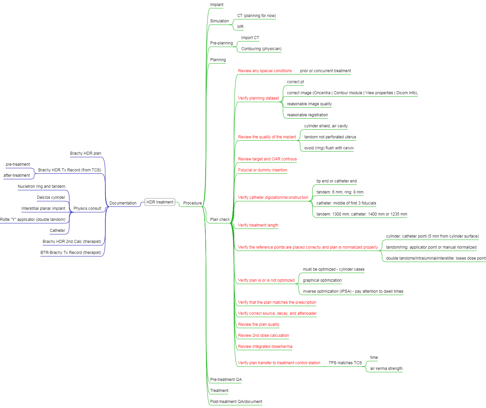

# HDR {#hdr}

## HDR vs. LDR

LDR: well-established treatment; standard doses, plan, and treatmetn time  
HDR: Outpatient treatment, short administration time, minimal staff exposure, standard source strength, and dose optimization[@stewart_current_2006][@showalter_hdr_nodate]

Up to date, commmon indications in practice are include:

- **GYN** (cervical [@liu_high_2014; @wang_high_2010], uterine, vaginal, vulvar)
- **Prostate** (monotherapy or boost)
- **Breast** (accelerated partial breast irradiation)
- possible Sarcoma, skin, esophagus, and bile duct

In recent review paper, authors [@liu_high_2014] showed that there is no difference in OS, DSS, LC, nodal occurrence, distance occurrence was found between LDR and HDR (from a meta-analysis of 4 clinical trials in _Cochrane database_ with a total of 1265 patients with advanced cervical cancer), but HDR is more convenient and accurate.[^question-hdr1]

[^question-hdr1]:
Excerpt *"Theoretically, HDR has a lower therapeutic ratio than LDR because of the short duration of the treatments."*" -  Practical Radiation Oncology Physics, [@dieterich_practical_2016] Chapter "Intracavitary Brachytherapy"

## HDR-QA {#hdr-qa}

> What am I testing and why am I testing it? 
>
> --- Susan Richardson 2017 AAPM [talk](https://www.aapm.org/education/vl/vl.asp?id=12300) EDBCCA  should be B and A

### Daily (device) QA

According [10 CFR35.643 "Periodic spot-checks for remote afterloader units""](https://www.nrc.gov/reading-rm/doc-collections/cfr/part035/part035-0643.html), the following tests are required:  

1. Electrical interlocks at entrance to room.
2. Source exposure indicator lights on the after loader, control console, and in the facility.
3. Viewing and intercom systems.
4. Emergency response equipment.
5. Radiation monitors to indicate source position ($\pm1$ mm) - `this test does not gurantee you the correct treatmetn position in the patient (e.g vaginal cylinder slid out 2 cm between imaging and treatment).`
6. Timer accuracy ($\pm1$ s).
7. Clock (date and time) in unit’s computer.
8. Decayed source activity in unit’s computer.

The <font color="Salmon">autheried medical physicist</font> (AMP) should review the daily QA within **15 days**. The APM shall notify the licensee as soon as possible in writing of the results of each spot-check. 

### Pretreatment QA (TG-59)

1. Two people (therapists?) should check proper **connection of catheters** to the HDR unit and that the transfer tubes are free of kinks.
2. The emergency kit and source container are available.
3. Survey meter and/or GM-counter is present and operational. - `The patient may have had a nuclear medicine scan prior to the treatment, causing an elevated reading. thus a **pre-treatment survey** is conducted though not listed in TG-59.`
4. The **length** of transfer tube and applicator (catheters) are correct.
5. Check applicator positioning. How do physicians check this item without image verification?
6. Treatment documentation review.
    a. Signed prescription and plan.
    b. Second check has been performed. (use emipircal values)
    c. Plan agrees with prescription.
    d. Plan is consistent with previous fractions if applicable.
    e. Dwell positions and times in plan agree with what is programmed on the treatment console. 
7. Patient identity confirmed by two methods.

At current practice, a **check-list** is used by physicists for pretrement plan QA and a time-out is conducted prior to initiating the treatment. 

### Source change {#hdr-source-change}

The half-life time is about 74 days, so the old source is sawpped with a new source about every 3 months. The activity of the new source is normally about **10 Ci**. According to Eq. \@ref(eq:sk) and Eq. \@ref(eq:exposure), the source strength is equal to 41100 U ($S_k = 10,000\ (mCi) \times 4.69 \left(\frac{{R\cdot cm}^2}{mCi\cdot hr} \right) \times 0.876 \left(\frac{cGy}{R}\right)$). This quantity will be verified by an AMP using NIST tracable well chamber and electrometer, and then enterred in the treatment planning system for dose calculation. The engineering from HDR afterloader vendor also verifies the source using their own equipment.

1. Verify the source cable **positioning accuracy** at two different programmed positions (1205 mm and 1400 mm) before the vendor engineering leaves (using GYN transfer tube).
2. Although the well chamber and electrometer is still within 2-year calibration period, we always do **consistence check** using a NIST-traceble Cs-137 source (we actually checked with 2 Cs-137 sources provided by our RSO). 
3. Switch a physics QA transfer tube and insert a catheter into Ir-192 insert.
4. Measure current at 5 positions (1195 mm, 1200 mm, 1205 mm, 1210 mm, and 1215 mm) and take an average
5. Check time-dose linearity
6. Check stopwatch accuracy (100 s)
5. Check transfer tube connection error
6. Switch emergency power switch

### Medical Events

* [Errors on NRC website](http://www.nrc.gov/reading-rm/doccollections/nuregs/brochures/br0117/) 
* [Wisconsin]((http://chapter.aapm.org/GLC/media/2011/tollenaar.pdf))
The purpose of reporting a medical event is to improve patients' safety. 
2017 AAPM Annual Meeting [An Interactive Safety Session for New Brachytherapy Practitioners](https://www.aapm.org/education/sams/Default.asp?v=true&mid=127&qid=2540)ED*C*CCA

## Sources 

A comprehensive seed data source can be found from a [database](http://www.physics.carleton.ca/clrp/seed_database) provided by Carleton University 

Because [Ir-192](https://www.estro.org/about/governance-organisation/committees-activities/tg43-ir-192-hdr) has much higher <font color="Salmon">special activity</font>[^sa] than most other isotopes, it is now the mostly used radio-isotope for HDR treatment. The higher the special activity means that the Ir-192 can be made with small physial dimension but still provide high radioactivity.  

[^sa]:
The special activity (SA) is defined as the activity per mass. It depends on half lifetime and atomic number, $SA \propto \frac{1}{T_{1/2}\cdot A}$. For example, $\frac{SA_{Co}}{SA_{Ir}} = \frac{74\ days \times 192}{5\ years \times 60} \approx 0.13$. Wait a second, how about SA of I-125? Although I-125 can have higher SA than Ir-192, the energy of I-125 is just too low for enough tissue penetration.  

Recently, Co-60 has been used as the HDR sources.[@nath_guidelines_2016]

## Treatment sites

The treatment guidelines can be found at American Brachytherapy Society (ABS) [website](https://www.americanbrachytherapy.org/guidelines/).

### Cervical cancer {#cervical}

The ABS recommends the use of brachytherapy as a component (after EBRT) of the definitive treatment of locally advanced cervical carcinoma. [@viswanathan_american_2012, @viswanathan_american_2012-1]

Based on the [talk](https://www.aapm.org/education/vl/vl.asp?id=4077]) by J. Schwarz, treating cervial cancer has progressed

- 1903 Stockholm and Paris
- 1938 Manchester – point A 
- 1953 Point A revision
- 1985 ICRU 38
- 1987 more point A updates
- 2000 GEC-ESTRO
    + D90, D100 for dose prescription
    + D2cc bladder, rectum, and sigmoid
- 2004 GTV and CTV delineation (**MRI**)
- 2005 GEC-ESTRO recommendation for IGRT brachytherapy
- ...

<font color="#27AE60"><i>Why is MRI preferred to CT for target delineation?</i></font>

- MRI has been soft tissue contrast.
- MRI has better overlap with FPG-PET volumes. (?more clinical[^clinical] importance)
- Improved overall survivial for large tumours (>5 cm), 28% versus 58% (p = 0.003), when the target is drawn on MRI.[@potter_clinical_2007]

<font color="#27AE60">What are the targets in MR-based HDR??</font>

Targets include gross tumor volume (diagnosis) (GTV~D~), gross tumor volume (brachy) (GTV~B1~, GTV~B2~, ...), high risk CTV (HR CTV~B1~, HR CTV~B2~, ...), and intermediate risk CTV (IR CTV~B1~, IR CTV~B2~, ...). The IR CTV include the microscopic disease, IR CTV = HR CTV + 5-15 mm margin. The details about target delineation and dose can be found in the recommendations from GEC-ESTRO Working Group (I)[@haie-meder_recommendations_2005].

**Idea**: availability of commercial dummy sources for MRI is limited. 

<font color="#27AE60"><i>What are the recommendations for using the MR-compatible applicators during MRI?</i></font>

The choice of MR sequence is essential for optimal visualisation of the applicator (plastic or titanium):[@dimopoulos_recommendations_2012; @haack_applicator_2009]

- Plastic has weak signal on T2; use of markers
- Titanium has (induced) susceptibility artifact, and thus more distortions for higher magnetic strength; worse on T2; T1 is more suitable (? Why Titanium is MR compatible? )
- If an applicator has been shown to be MR conditional for a 1.5T MRI, then it does **not** mean that it can be safely used in a 3T system without the need for further testing. CT still provides best imaging for applicator in terms of spatial accuracy (1 mm on CT vs. 1-2 mm on MRI for the localization of first dwell position) and artifacts.


### Breast

ABS acceptability criteria for APBI

- Age: $\ge$ 50 year old
- Size: $\le$ 3 cm
- Histology: All invasive subtypes and DCIS
- Estrogen receptor: +/-
- Surgical margin: -
- Lymphovasucular space invasion: not present
- Nodal status: -

Treatment planning

- 34 Gy in 10 fractions twice daily
- PTV~Eval~
        + D90% >= 90%
        + V150 < 50 cm^3^
        + V200 < 10 cm^3^
        + Skin dose < 145% of prescription

They are slightly different from ASTRO Consensus Statement 2009. 

### Prostate

[ABS consensus guidelines for high-dose-rate prostate brachytherapy](https://www.sciencedirect.com/science/article/pii/S1538472111004004)

Monotherapy: 13.5 Gy $\times$ 2 fractions (NCCN) 

### Endometrial cancer

[ABS consensus guidelines for adjuvant vaginal cuff brachytherapy after hysterectomy](https://www.sciencedirect.com/science/article/pii/S1538472111003874?via%3Dihub)

- Dose fractionation: 7Gy $\times$ 3 prescribed to 0.5 cm is a common fractionation scheme with active length of 5 cm ($\color{Purple} {\text{Are we treating vaginal cuff or the whole vigina?}}$)
- the standard applicator is a segmented cylinder with one central catheter; the **largest diameter** cylinder that patient can tolerate is used to minimize the air gap between cylinder and vagina and to avoid rapid dose fall-off.

## Oncentra planning

The workflow for the latest Oncentra planning system looks like

```{r echo=FALSE, warning=FALSE, oncentra-wf, fig.align='center', out.width='80%',fig.cap= 'Oncentra workflow (from Elekta online [document](https://www.elekta.com/dam/jcr:0361c151-4eb5-4017-a5b6-6a35c4398671/Oncentra%C2%AE%20Brachy%20brochure.pdf))'}
knitr::include_graphics("figures/oncentra-workflow.png")
```

The overall planning and QA mindmap 

```{r echo=FALSE, warning=FALSE, hdr-map, fig.align='center', fig.cap= 'HDR planning and QA mindmap'}

```

## Saftey and shielding design

Typical room ~ 60 cm concret

**Q3 TG43U ** d)  

Using Eq. \@ref(eq.tg43) or TG-43U1 2D Brachytherapy dosimetry formalism,

\begin{equation}
\begin{aligned}
   \dot D(r, \theta) &= \Lambda\cdot S_k \frac{G_L(r, \theta)}{G_L(r=1cm,\theta=90^o)} \cdot g_L(r, \theta)\cdot F(r,\theta)\\
   &=1.12\ cGy/(h\cdot U)\cdot4.11\times10^4\text{U}\cdot1.023\cdot1\\
   &=\boxed{13.1\ cGy/s}
\end{aligned}

\end{equation}


The half-life time of Ir-192 is about 74 days, so activity after 90 days (Eq. (\@ref(eq:decay2))) is
\begin{equation*}
    A_2 = A_02^{-t/T_{1/2}}=A_02^{-90/74}=0.43A_1
\end{equation*}

To maintain the prescribed dose ($\dot D_1 \Delta t_1 = \dot D_2 \Delta t_2$ and $A \propto \dot D$, the dwell time $\Delta t_2$ will be 

\begin{equation*} 
{\Delta t_2 = \frac{\dot D_1}{\dot D_2} \Delta t_1 = \frac{\dot A_1}{\dot A_2} \Delta t_1 = \frac{1}{0.43}\times 16 \text{ min} \ \times 80\% = \boxed{29.7 \text{ min}}}
\end{equation*}
The total treatment time will be $29.7 + 16\times20\%=\boxed{33\ \text{minutes}}$. 

## Solutions

`Q4 Afterloader QA a)`  
`Q5 Shiedling b)`  
`Q6 Impact of decay on treatment timee`  
`Q7 c)`  
`Q8 c)`  
`Q9 b)`
`Q10 a) but esophagus cancer is also treated with HDR but with less indication`  
`Q11 b)`  
`Q12 d)`  

Perceive and Believe
Stay Calm
Think, plan, and analyze
Take decisive action
Celebrate success
