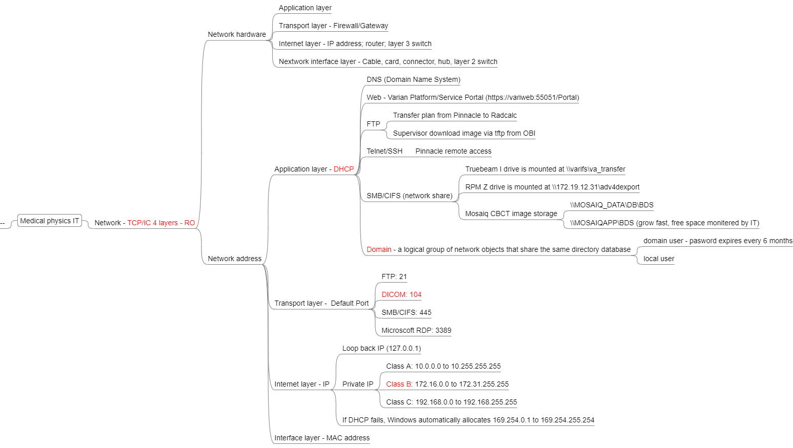

# Information Technology {#it}

## IT basics

[AAPM TG-201 - Information technology resource management in radiation oncology (2009)](https://www.aapm.org/pubs/reports/detail.asp?docid=142) 

```{r echo=FALSE, warning=FALSE, it, fig.align='center',fig.cap= 'Medical physics IT'}

```

## DICOM

## Database basics

## Programming

### Unix/OS

#### The find Command

You can search files by type (`-type`), name (`-name`), modified time (`-mmin`), size (`-size`), permission (`-perm`), 

<font color="blue">find . -type f -name "test*"</font>: to find files (type) with names starting with test

<font color="blue">find . -type f -name "*.pyc" -exec rm {} + </font>: to find files with names ending with _pyc_, and then delete (rm) all those files (hold in {}) (+ to terminate the line)
</p>

#### The grep command

You search **patterns** in files and directories

<font color="blue">grep -wir "John Williams" ./</font>: to recursively (r) search "John Williams" in names.txt with whole word match (w) and case insensitive (i)

<font color="blue">grep -P "\\d{3}-\\d{3}-\\d{4}" names.txt</font>: to search the name.txt with pattern (-P) of telephone numbers


#### The crontab command

This command will allow you to run commands on a repetitive schedule. 