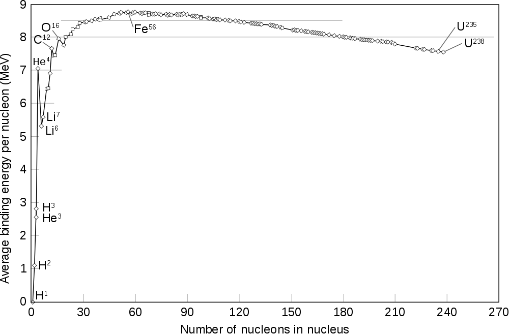
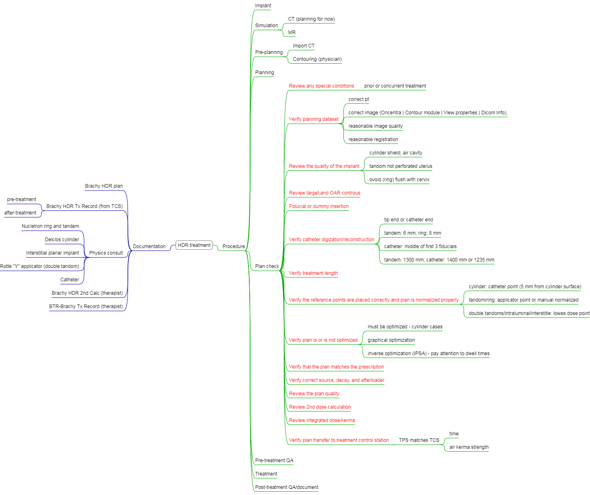

--- 
title: "MP"
author: "pqi"
site: bookdown::bookdown_site
documentclass: book
bibliography: [book.bib, packages.bib, Brachy.bib]
biblio-style: apalike
link-citations: yes
urlcolor: blue
linkcolor: magenta
citecolor: green
<<<<<<< HEAD
description: ''
=======
csl: pmb.csl
description: "This is a minimal example of using the bookdown package to write a book. The output format for this example is bookdown::gitbook."
>>>>>>> 2a4bc3ea0271590c20e0c73bbf188686bb10c011
---

# Welcome {-}

This *book* is a collect of study notes and thoughts during my experience switching from atomic, molecular, and optic physics to medical physics and practicing medical physics specialized in stereotactic body radiotherapy/radiosurgery, brachytherapy (high dose rate brachytherapy, intra-operative radiotherapy, Y-90 microsphere therapy, ...), and hyperthermia treatment. It is my belief that a good book should provide resources for readers to find or possibility to find the most straightfoward and clear answer to the question or chanllenge occurred to them. Therefore, I presented mixed different types of representations such as pictures, bulletin points, paragraphs, videos (links), which have given me the best understanding for specific questions, for your reference. 

```{r eval=FALSE, include=FALSE}
install.packages("bookdown")
# or the development version
# devtools::install_github("rstudio/bookdown")
```

```{r include=FALSE}
# automatically create a bib database for R packages
knitr::write_bib(c(
  .packages(), 'bookdown', 'knitr', 'rmarkdown'
), 'packages.bib')
```

<!--chapter:end:index.Rmd-->

# Introduction {#introduction}

## Physics constants {#constant}

The constants are available from the [here](http://physics.nist.gov/cuu/Constants/) supported by National Institute of Science and Technology (NIST). 

The important __constants__ used in medical physics are:

* Avogadro constant: $N_A = 6.022\times10^{23} mol^{-1}$
* Speed of light in vacuum: $c = 2.998\times10^8\ m/s$
* Atomic mass constant: $u = 1.661 \times 10^{−27}\ kg = 931.5\ MeV/c^2$
* Elementary charge: $e = 1.602 \times 10^{−19}\ C$
* Electron rest mass: $m_e = 9.109 \times 10^{−31}\ kg = 0.5110\ MeV/c^2$
* Proton rest mass: $m_p = 1.673 \times 10^{−27}\ kg = 1.007\ u = 938.3 MeV/c^2$
* Neutron rest mass: $m_n = 1.675 \times 10^{−27}\ kg = 1.009\ u = 939.6 MeV/c^2$
* Planck constant: $h = 6.626 \times 10^{−34}\ J\cdot s = 4.136 \times 10^{−15}\ eV\cdot s$

The SI system of units

The __7 base quantities__ and their units are

<<<<<<< HEAD
=======
* Length: meter (m)
* Mass: kilogram (kg) 
* Time: second (s)[^si-second]
* Electric current: ampere (A)
* Temperature: kelvin (K)
* Amount of substance: mole (mol)
* Luminous intensity: candela (cd)

<<<<<<< HEAD
[^si-second]:
The SI standard: 1 second is defined to be exactly 9,192,631,770 cycles of a Caseium [atomic clock](https://en.wikipedia.org/wiki/Atomic_clock) (a hyperfine transition/decay with wavelength of 3.26 cm). As long as you can count this large number accurately, the accuracy fo this type of atomic clock is about $10^{-10}$ ($\approx 1/9,192,631,770$). 

=======
>>>>>>> db0111413f398327f1cf26330f8ca6bf71467937
>>>>>>> 2a4bc3ea0271590c20e0c73bbf188686bb10c011
## Atomic Representation {#atomic-rep}

Atoms = Nucleus (neutron and protons)[^rutherford] + Orbital electrons[^bohr]

$$^A_ZX$$

<<<<<<< HEAD
* A (mass number) - the number of protons and neutrons
* Z (atomic number) - the number of proton number
* X (chemical element) - for the element
=======
<<<<<<< HEAD
* A (`mass number`) - the number of protons and neutrons
* Z (`atomic number`) - the number of proton number
* X - `chemical symbol` for the element
=======
* A ($\color{Green}{\text{mass\ number}}$) - the number of protons and neutrons
* Z ($\color{Green}{\text{atomic\ number}}$) - the number of proton number
* X ($\color{Green}{\text{chemical\ element}}$) - for the element
>>>>>>> db0111413f398327f1cf26330f8ca6bf71467937
>>>>>>> 2a4bc3ea0271590c20e0c73bbf188686bb10c011

Atomcs can be classified in terms of the **same** number of protons, neutrons, mass, and (meta)state.

* Isoto**p**e - same number of **p**rotons
* Isoto**n**e - same number of **n**eutrons
* Isob**a**r - same **a**tomic number
* Iso**m**er - same A, Z, N but different energy meta-states; eg $_{43}^{99m}Tc$ is in metastable[^metastable] state and $^{99}_{43}Tc$ is in stable state)

## Stability

The stability depends on the ratio of neutron and proton (see Figure \@ref(fig:halflife))

<<<<<<< HEAD
```{r echo=FALSE, warning=FALSE, fig.align='center', out.width='80%', fig.cap="Stability of isotopes"}
=======
```{r echo=FALSE, warning=FALSE, halflife, fig.align='center', out.width='80%', fig.cap="Stability of isotopes"}
>>>>>>> db0111413f398327f1cf26330f8ca6bf71467937
knitr::include_graphics("figures/isotope_halflife.png")
```

## Mass Defect {#mass-defect}

The mass of an atomic nucleus is less than the sum of the individual masses of the free constituent protons and neutrons. This “missing mass” is known as the mass defect. For example, the mass defect of a ^12^C atom can be calculated by:
$$ 6 \times m_p + 6 \times m_n + 6 \times m_e - m_{C} = 0.0988\ amu$$
where $m_C = 12$ (the ratio of mass to 1 amu). The complete list of mass number can be found in the [NIST database](https://physics.nist.gov/cgi-bin/Compositions/stand_alone.pl). 

<<<<<<< HEAD
The mass defect is closed related to *nuclear binding energy*. If we divide the above energy by 12 and times 931.5 MeV/amu, we obtain the bind energy per neucleio for ^12^C is 7.67 (see Figure \@ref(fig:stability)) 
=======
<<<<<<< HEAD
The mass defect is closed related to `nuclear bind energy`. If we divide the above energy by 12 and times 931.5 MeV/amu, we obtain the bind energy per neucleio for ^12^C is 7.67 (see figure below) 

```{r echo=FALSE, warning=FALSE, fig.align='center', fig.cap= 'Nuclear binding energy per nucleon (The image is from wiki)'}
=======
The mass defect is closed related to $\color{Green}{\text{nuclear binding energy}}$. If we divide the above energy by 12 and times 931.5 MeV/amu, we obtain the bind energy per neucleio for ^12^C is 7.67 (see Figure \@ref(fig:stability)) 
>>>>>>> 2a4bc3ea0271590c20e0c73bbf188686bb10c011


```{r echo=FALSE, warning=FALSE, stability, fig.align='center', out.width='80%',fig.cap= 'Nuclear binding energy per nucleon (The image is from wiki)'}
>>>>>>> db0111413f398327f1cf26330f8ca6bf71467937

```

A complete table of nuclear bind energies can be found on Lawrence Berkeley National Laboratory [(link)](http://xdb.lbl.gov/Section1/Table_1-1.pdf).

## High energy charged particles {#einstein}

The mass of a moving particle (not a photon) depends on its velocity $\upsilon$ and its rest mass $m_0$.

\begin{equation}
    E_{total} = mc^2 = \frac{m_0c^2}{\sqrt{1-\frac{\upsilon^2}{c^2}}} 
    (\#eq:emc2)
\end{equation}
or
\begin{equation}
    E_{total} = E_{0}+E_{K.E} = m_0c^2 + E_{K.E}
    (\#eq:total-E)
\end{equation}

<hr>

```{block, type='FOO'}
What is the velocity of an electron with a kinetic energy of 2 MeV?
```
Using Eq. \@ref(eq:emc2) and \@ref(eq:total-E), 0.511 MeV + 2 MeV = 0.511  MeV/${\sqrt{1-\frac{v^2}{c^2}}} \rightarrow v \approx$ 0.96 c.

Similarly, you can find that to accelerate a proton to the velocity of 0.96 c, the kinetic energy will be about **2,400 MeV**, i.e., you need give much more energy to accelerate protons to the speed close to the speed of light (proton machine is much larger). 

<hr>

## High energy photons

The energy of a photon is given by

\begin{equation}
    E = h\times v
    (\#eq:frequency)
\end{equation}
where h is the Planck constant ([Physical constants](#constant)), $v$ is the frequency in unit of s^-1^ or Hertz.

Or
\begin{equation}
    E\ (eV) = \frac{1,240}{\lambda\ (nm)}, 
    (\#eq:wavelength)
\end{equation}

<hr>

```{block, type='FOO'}
What are the energy and frequency of a photon of wavelength of 400 nm in vaccum? What are the wavelength and frequency of a 6 MV photon? 
```
Using Eq. \@ref(eq:wavelength), the energy is about 3.1 eV. Using Eq. \@ref(eq:frequency) and 1 eV = 1.6 $\times$ 10^-19^ J, the frquency is $\frac{(3.1\ eV)\times (1.6\times 10^{-19}J/eV)}{6.626\times 10^{-34}J\cdot s}= 7.5 \times 10^{14}$ Hertz. 

The wavelength of a 2 MeV photon is $\frac{1240}{2\times 10^{6}\ eV} = 6.2 \times 10^{-4}$ nm. It is much samller than the size of an atom (**0.1 nm**) or that of DNA (**2.5 nm**). The size of a hydrogen nuclei is about 1.76 $\times$ 10^-6^ nm. 

<hr>

## Electron Shell

- <span style="color:Salmon"> Principle </span> quantum number ($n = 1, 2, 3, ...$ or K, L, M, ...)  – the main energy level (or shell) occupied by an electron. The energy can be calculated by$$E_n=\frac{Z^2{\hbar}^2}{2m_0\alpha^2_Bn^2},$$ where $\alpha_B$ is the <span style="color:Salmon">Bohr radius </span> (= 5.29 $\times$ 10^-11^ m). The __K shell__ (binding) energy for Lead, Tungsten, and Carbon are 88 KeV, 69.5 KeV, and 0.28 KeV. 
- <span style="color:Salmon"> Secondary </span> quantum number ($l = s, p, d, ...$)  – the energy sublevel (angular monentum) occupied by the electron.
- <span style="color:Salmon"> Magnetic </span> quantum number ($m_l = -l, -l+1, ..., 0, ..., l-1, l$) – the number of possible orientations (projections) for each of energy sublevels.
- <span style="color:Salmon"> Spin </span> quantum number ($m_s=-1/2, 1/2$) – the two possible orientations that an electron can have in the presence of a magnetic field.

## Solutions

`Q1: a), c), (e)` see Section \@ref(atomic-rep)  
`Q2: b), d); a) is wrong because they are isotopes; c) is wrong because they are isobars.`  
`Q3: a), b), and c)`  
`Q5: b), c); a) should be 6 neutrons and d) should be 12 times 931 MeV.`  
`Q6: see above`  
`Q7: b)`  
`Q8: d)` see Section \@ref(einstein)  
`Q9: c)`   
`Q10: a)`   
`Q11: b)`    
`Q12: a), b), c), e)`    
`Q13: b), c)`  
`Q14: c)`  
`Q15: b) using Eq. \@ref(eq:wavelength)` 
`Q16: c)` using Eq. \@ref(eq:wavelength)

[^metastable]:
Metastabe state is an excited state of an atom that has a longer lifetime than the ordinary excited states but generally has a shorter lifetime than the lowest, often stable, energy state, called the ground state. [britannica](https://www.britannica.com/science/metastable-state) 

[^rutherford]:
Rutherford interpreted the results of the [gold foil experiment or Geiger-Marsden experiment](https://en.wikipedia.org/wiki/Geiger%E2%80%93Marsden_experiment) and established the Rutherford model of atom, which constitutes a tiny ($10^{-15}$ m), heavy nucleus which consists of protons and/or neutrons. He also won [the Nobel Prize in Chemistry 1908](https://www.nobelprize.org/nobel_prizes/chemistry/laureates/1908/) “for his investigations into the disintegration of the elements, and the chemistry of radioactive substances”. He discovered three types of radiation: $\alpha$, $\beta$, and later $\gamma$ radiation. 

[^bohr]:
In 1913, Bohr proposed a theory for the hydrogen atom based on __quantum theory__ that (a) electrons orbit around the nucleus; (b) electrons orbits at a certain discrete set of distances from the nucleus without radiation and energy loss; (c) electrons can only gain and lose energy by jumping from one allowed orbit to another, absorbing or emitting electromagnetic radiation with a frequency: $v=\frac{E_m-E_n}{h}$. He won [the Nobel Prize in Physics 1922](https://www.nobelprize.org/nobel_prizes/physics/laureates/1922/).

[^amu]:
atomic mass unit; 1/12 mass of $_6^{12}\textrm{C}$ atom in quantity; $1amu = 1.66 \times 10^{-27} kg$ or **931.5** MeV.


<!--chapter:end:01-intro.Rmd-->


# Nuclear Transformation {#nut}

Placeholder


## Nuclear Decay (disintegration) {#decays}
### Alpha-decay {#alpha}
### Beta-decay {#beta}
### Electron capture {#ec}
### Gamma decay {#gamma}
## Activity {#activity}
## Solutions

<!--chapter:end:02-nucl.Rmd-->


# Production of X-rays {#prox}

Placeholder


## History
## Conventional x-ray tubes
### Electron Source (Cathode)
### High voltage
### Target for x-ray production
### Target X-ray spectra
## Solutions

<!--chapter:end:03-proxray.Rmd-->


# Clinical Treatment Generators {#gene}

Placeholder


## History
## Waveguide
## Microwave amplifier  
## Microwave frequency 
## Penumbra 

<!--chapter:end:04-generator.Rmd-->


# Interaction {#inter}

Placeholder


## Photoelectric interactions {#photo-el}
## Compton interactions {#compton}
## Pair production {#pair}
## Compton interactions 

<!--chapter:end:05-interaction.Rmd-->


# Measurement of Ionizing Radiation {#measurement}

Placeholder


## Collection volume
## Signal of an ion chamber
## Temperature and pressure correction
## Guard electrode

<!--chapter:end:06-measurement.Rmd-->

# Quality of X-rays {#quality}

We have finished a nice book.

<!--chapter:end:07-quality.Rmd-->


# Absorbed Dose {#dose}

Placeholder


## Optical density
## Q9 OD

<!--chapter:end:08-dose.Rmd-->


# Dose Distributions {#distribution}

Placeholder


## TAR

<!--chapter:end:09-distribution.Rmd-->

# Dose calcuation {#dosecalc}

We have finished a nice book.

<!--chapter:end:10-dosecalc.Rmd-->


# Treatment Planning I: Isodose Distribution and Plan Evaluation {#planning1}

Placeholder


## Penumbra
## Wedges

<!--chapter:end:11-planning1.Rmd-->


# Treatment Planning II: Patient Data, Corrections, and Setup {#planning2}

Placeholder


## Inhomogeneity
## Range
## MRI
## PET

<!--chapter:end:12-planning2.Rmd-->


# Treatment Planning III: Field shaping, skin dose, and field separation {#planning3}

Placeholder


## HVL
## Q2, 3, 4, and 7 Range

<!--chapter:end:13-planning3.Rmd-->


# Electron {#electron}

Placeholder


## History
## Treatment Sites^[Electron Radiotherapy, Past, Present, and Future (https://vimeo.com/78553521)]
## Interactions {#e-interactions}
## Delivery {#e-delivery}
## Beam quality
## Internal shielding 
## Total skin electron irradiation (TSEI)
## Solutions {#e-solu}

<!--chapter:end:14-electron.Rmd-->


# Brachytherapy {#brachy}

```{r eval=FALSE, warning=FALSE, include=FALSE}
knitr::include_url("https://doctorlib.info/oncology/principles-practice-radiation-oncology/22.html", height="600px")
```

> Brachytherapy began at the turn of 20th century, contemporary with external beam radiotherapy. Physicsits and physicians together developed the field. There has not been a period since the beginning that has not witnessed innovations and progress in brachytherapy
>
> --- B.R. Thomadsen in "Anniversary paper: past and current issues in brachytherapy physics"

**Why Brachytherapy is important?**

1. Brachytherapy is part of the starndard of care
2. Better local control rates for certain disease site than using external beam technique

## Important things to know

Dose rates defined in  ICRU 38 (1985) and [NRC 10 CFR part 35](https://www.nrc.gov/reading-rm/doc-collections/cfr/part035/)

- Ultralow dose rate: **0.01-0.3 Gy/hr** (prostate implants)
- Low dose rate: 0.4-2.0 Gy/hr
- Medium dose rate: 2-12 Gy/hr
- High dose rate: **>12 Gy/h**; modern HDR can deliver about **420 Gy/hr** or <font color="red"><b>7 Gy/min</b></font>
- Pulsed dose rate

Brachytherapy category depending on placement of sources

- Plaques or mold - eye plaques
- Interstitial - prostate implants
- Intracaitary - HDR cylinder
- Intraluminal - Bile duct, esophagus, IVBT
  

## Isotopes

### Radium sources

Radiumsources used for implant therapy contain Ra-226 in secular equilibrium (takes about 1 month, see Section \@ref(decays)) with its decay products (stable Pb-206).[^radium] 

[^radium]:
The radium was supplied in the form of a salt, which was mixed with an inert filler such as magnesium oxide or barium sulfate. The small crystals of radium salt and filler were contained within cylindrical cells about 1 cm long. The cells were made of gold foil 0.1 to 0.2 mm thick and were sealed to prevent the escape of radon gas. Each source of radium contained 1 to 3 cells surrounded by a wall of platinum, reinforced with iridium (10%). The thickness (usually 0.5 or 1 mm) of the platinum-iridium wall was sufficient to absorb $\alpha$ and $\beta$ radiation from the source. Gamma rays were attenuated only slightly by the wall.

The exposure rate from a 1 mCi point source of ^226^Ra that is in secular equilibrium with its decay products and enclosed within a 0.5 mmPt-Ir wall is 8.25 R/hr at a distance of 1 cm. The value of **8.25 R$\cdot$cm^2^/hr$\cdot$mCi** is referred to as the <font color="Salmon">exposure rate constant</font>. The average energy is about 0.7-0.8 MeV, raning from less than 50 keV to 2.5 MeV. In shielding design, we need to consider the existence of high energy gamma rays although their contribution is small. The thus HVL(TVL) for Ra-226 is 1.66 cm (5.5 cm) (NRC [link](https://www.nrc.gov/docs/ML1122/ML11229A721.pdf)), which is greater than that for Co-60 (E~{mean}~ = 1.25 MeV)

### Radium substitutes

Table: (\#tab:isotopes) Frequently used radioactive isotopes[^atten]

Isotope | $T_{1/2}$ (days)| Median E (KeV)| HVL (mm lead) | usage
----------------- |---------- |---------- |---------- |----------
Cs-137| 30 years | 660 |5.5 | -
Ir-192| 74 | 400 |2.5 | interstitial implantation (in ribbon)
I-125| 60 | 28 | 0.025 | prostate implants (\@ref(implants)), eye plaques
Pd-103| 17 | 22 | 0.01 | prostate implants (\@ref(implants))
Cs-131| 10 | 29 | -    | intracavitary BT of uterine cervix
Au-198|2.5 | 400 | 2.5 | eye plaque
Y90 ($\beta$ emitter)| 2.67 | 937 | -   | liver radioembolism

## Source strength

The progression of specification of source strength

- Radium sources has been specified in terms of <strike>mass</strike> of radium
- Cesium sources was specified in terms of <strike>milligram equivalents of radium</strike> (mg$\cdot$Ra$\cdot$eq)
- Sources can also be specified in terms of activity; <strike>apparent activity</strike>, of a source is determined from a measurement of the exposure rate at a distance; it describes the activity of that nuclide that would produce the same exposure rate when unencapsulated.
- AAPM recommends <font color="Salmon">air-kerma strength</font>.

### Unit: Air-kerma strength $S_k$ {#sk}

Air-kerma strength (S~k~) of brachytherapy sources is defined as the <font color="Salmon">air-kerma rate</font> ($\dot{K}_{\delta}$) at a reference distance (e.g. 1 m) from the source center along the perpendicular bisector. The air-kerma strength is related to the quantity exposure rate by[^sk_measurement]

\begin{equation}
  S_k =\dot K_\delta \cdot d^2 = \dot X(d) \cdot  \left( \frac{\bar W}{e}\right) \cdot d^2,
  (\#eq:sk)
\end{equation}

The SI unit of air-kerma strength Gy m^2^ s^-1^ or __$\mu$Gy m^2^ h^-1^__. The exposure rate $\dot X(d)$ is measured using an ion chamber, a "reentrant"-type well chamber, or a dose calibrator supplied with a suitable standard source. The term $({\bar W}/e )$ is the averagy energy to create an ion pair (**0.876 cGy/R**). 

The international community uses the term of <font color="Salmon">reference air-kerma rate</font>  (RAKR), which is defined as the air kerma rate at 1 m from the source in $\mu$Gyh^{-1}^

## Radiation dose from brachytherpay sources

### From exposure rate

Early prescriptions for brachytherapy treatments were expressed in terms of radiation exposure.  

The exposure rate (in R/hr) at some distance, r (cm), from a point source of radioactive material is:

\begin{equation}
   \dot X = \frac{\Gamma_{\delta}A}{r^2}
   (\#eq:exposure)
\end{equation}

where A is the activity of the source, and $\Gamma_{\delta}$ is the `exposure rate constant` for the nuclide. For example, $\Gamma_{\delta}$ is 3.28, 4.62, 1.45, and 1.48 R$\cdot$cm^2^/hr$\cdot$mCi for ^137^Cs, ^192^Ir, ^125^I, and ^103^Pd, respectively.

The resulting `Sievert integral` is shown 
\begin{equation}
   \dot D(r, \theta) = \frac{\Gamma_{\delta}Af}{lr}\int^{\theta_2}_{\theta_1}e^{-\mu t/cos{\theta}}d\theta
\end{equation}
where f is the $f$ factor (exposure to dose conversion), $l$ is the length of source. 

Although the effects of photon scatter and attenuation in tissue are neglected, dose calculations can be reasonably accurate because contributions of scattered radiation to a point very nearly compensate for the tissue attenuation of radiation reaching the same point.

### TG-43 {#tg43}

Most brachytherapy dose calculations are now based on TG-43 and its updates[^tg43-updates] and are done using computer programs. It should be noted that most current dose calculation still assumes that all material is **water equivalent**. 

The four principal factors influencing the relative dose distribution include: 1) **Distance** - a factor of 100 between the distances of 0.5 and 5 cm while the remaining factors over the same distance range rarely exceeds a factor of 2 or 3; 2) **Attenuation and scattering in source structure** - the dose near the longitudinal axis is usually smaller than on the transverse axis; 3) **Attenuation by surrounding medium** - compton scattering and photoelectric absorption; 4) **Accumulation of scattering in surrounding medium**. 

Although the manual calculation is not needed, it is helpful to understand how the dose distributions are calculated in TG-43. In TG-43, the dose rate distribution around a sealed brachytherapy source can be determined in two-dimensions (2D) using the following equation:
\begin{equation}
   \dot D(r, \theta) = \Lambda S_k \frac{G_L(r, \theta)}{G_L(r=1cm,\theta=90^o)} g_L(r, \theta) F(r,\theta),
   (\#eq:tg43)
\end{equation}
or a simplified 1D version
\begin{equation}
   \dot D(r) = \Lambda S_k \frac{1}{r^2} G_p(r)\phi_{an}(r),
   (\#eq:tg43-1D)
\end{equation}

where r denotes the distance (cm) from the center of the active source to the point of interest and $\theta$ is the point of interest relative to the source longitudinal axis.

```{r echo=FALSE, warning=FALSE, tg-43, fig.align='center', out.width='70%',fig.cap= 'TG-43 dose calculation'}

```


**Dose rate constant**

The `dose-rate constant` is defined as:
\begin{equation}
   \Lambda = \frac{\dot D(r_0, \theta_0)}{S_k}.
   (\#eq:dose-rate-constant)
\end{equation}

It can be thought as the dose rate in water at a reference point ($r_0$ = 1 cm for photon sources and 2 mm for beta emitters) along the transverse axis ($\theta = 90^{\circ }$) for source strength of 1 U. 

**Radial dose function and geometry function** 

The `radial dose function` g(r) represents the attenuation of radiation in tissue, defined as  
\begin{equation}
g(r) = \frac{\dot D(r,90^{\circ})\cdot G(r_0,90^{\circ})}{\dot D(r_0,90^{\circ})\cdot G(r, 90^{\circ})}.
\end{equation}
where $G(r,\theta)$ is the `geometry function` which accounts for the effect of the distribution of radioactive material inside the source on the dose distribution at a given point. It is equal to $1/r^2$ for point source approximation, $\frac{tan^{-1}[(x+L/2)/y]-tan^{-1}[(x-L/2)/y]}{Ly}$ or $\frac{1}{x^2-(L/2)^2}$ for linear source approximation with $\theta \neq 0^{\circ}$ or $\theta = 0^{\circ}$ and $x>L/2$.

**Anisotrpic function**

$F(r,\theta)$ is the `anisotropy function`, defined as
\begin{equation}
F(r,\theta) = \frac{\dot D(r,\theta)\cdot G(r,90^{\circ})}{\dot D(r,90^{\circ})\cdot G(r, \theta)}.
\end{equation}
It accounts for anisotropy of dose distribution around the source, including effects of absorption and scatter in medium, i.e., self-filtration in source, oblique filtration in walls, scattering and absorption in tissue. In TG-43U, typically calculated from Monte Carlo. 

```{r echo=FALSE, message=FALSE, warning=FALSE, dpi=120}
#knitr::include_url('https://www.estro.org/about/governance-organisation/committees-activities/tg43')
```

The example information about Elekta Flexisource can be seen in the figure below
```{r echo=FALSE, message=FALSE, warning=FALSE}
knitr::include_graphics("figures\\Ir-192.jpg")
```

In brachytherapy there is a rapid falloff in dose as distance from the source increases due to inverse square law. The dose within the tumor may much different from the prescription dose, thus the concept of equivalent uniform dose (EUD) was introduced by Dale et al. (1997). Mathematically, the generalized EUD is defined as 
\begin{equation*}
EUD= \left( \sum \nu_iD^a_i \right ) ^{1/a}
\end{equation*}

Here $\nu_i$ is the fractional organ volume receiving a dose $D_i$ and a is a tissue-specific parameter that describes the volume effect. 

- $a \rightarrow -\infty$, EUD = minimum dose; 
- $a \rightarrow -\infty$, EUD = maximum dose (serial organs); 
- a = 1, EUD = mean dose;
- a = 2, EUD = RMS dose.

The EUD model is parameterized by the single biological parameter a, which should be chosen so that the EUD reflects the intended biological properties for the given tumor or organ. Parameter a and the Lyman model parameter n are related by a = 1/n
	Tumor: a is a negative number (e.g., a = -15)
	Normal tissues: a is a positive number 

The volume-effect: very small normal tissue volumes (e.g. 1-2 cm3) can tolerate very high doses that larger volumes would not tolerate. There are a few exceptions to this such as spinal cord, though the dose as high as 167.3 Gy to the cord has been reported in very low dose rate brachytherapy of paraspinal tumor. Rogers et al. (2002) reported that the mean cord dose was 72.5 Gy (ranging: 53.1-167.3 Gy), combining the EBRT and I-125 brachytherapy. 

Radiation safety of brachytherapy sources

- Storage - shielding container; forceps, personal dosimetry
- Test for tumor distribution of activity -  `autoradiography` using films (exposure distribution + source physicial position and shape)
- Evaluation the safety - `leak test` (the source is swapped with a moistened cotton swab, which is then placed into a `scintellation` counter). If you discover leaking seeds upon receiving them, you should contact the manufactor and your regulator (RSO?) and follow their guidance.

## Solutions {#ldr-solutions}

`Q1 d)`  
`Q2 Shielding b)` 
`Q3 a) b) c)` 
`Q4 a)`
`Q5 a)` 
`Q6 Initial dose rate c)`
`Q7 b)`  
`Q8 The Paterson-Parker system c)`    
`Q9 The Quimby system a)`  
`Q10 The Paris system c) d)`  

As $D = \dot D\times\Delta t$, $\frac{\Delta t_{new}}{\Delta t_{old}}=\frac{\dot D_{old}}{\dot D_{new}} = \frac{A_{old}}{A_{new}} = \frac{A_0e^{-10/30}}{A_0} = 0.79$  

  
Although the average energy of ^60^Co is higher than that of ^226^Ra, there are gamma rays of 1.76 and 2.2 MeV emitted from ^226^Ra sources. In shielding design, we need to consider their existence (although their contribution is small) and thus HVL for ^226^Ra is greater than HVL for ^60^Co.^[https://www.nrc.gov/docs/ML1122/ML11229A721.pdf]  

A ^137^Cs source is normally used for consistence check (like linac monthly QA) but not calibration.  

Like external beam radiotherapy, the inverse square law is always the biggest factor for dose calculation.  

Should c) and d) be correct?  
  

The prescription dose or total dose for an prostate implant is

\begin{equation*}
D = \int^{\infty}_0 \dot D_0 \cdot e^{-\frac{0.693}{T_{1/2}}t}dt
\end{equation*}

Using an important definite integral, $\int^{\infty}_0 e^{-ax} dx = \frac{1}{a}$, we can find that 

\begin{equation*}
D = \dot D_0 \cdot \frac{T_{1/2}}{0.693} \rightarrow \dot D_0 = \frac{D}{59.4/0.693}=\frac{14400 \text{ cGy} \times 0.693}{59.4 \text{ days} \times 24 \text{ hours/day}} = \boxed{7.0\text{ cGy/hr}}
\end{equation*}


[^atten]:
Form the NIST table (https://physics.nist.gov/PhysRefData/XrayMassCoef/ComTab/water.html), the total attenuation coefficients in water are about 0.38, 0.1, and 0.09 cm^-1^ for the photon energies of 30 (I-125), 400 (Au-198 and Ir-192), and 600 KeV (Cs-137), respectively. A good reference can be found at https://aapm.org/meetings/amos2/pdf/42-11873-3201-79.pdf

[^sk_measurement]:
The equation above is a revised definition of air-kerma strength (new cutoff energy 5 keV); experimentally, an aluminum filter is put in front of [NIST wide angle free-air chamber (WAFAC)](https://www.nist.gov/programs-projects/calibration-low-energy-photon-brachytherapy-sources) to get rid of photons with lower energies. 

[^tg43-updates]:
Other TG 43 updates include: 1) eliminating apparent activity for specification of source strength, 2) eliminating the anisotropy constant in favor of the distance dependent 1-D anisotropy function, $\phi_an(r)$, and 3) providing guidance on extrapolating tabulated TG-43 parameters to longer and shorter distance.  
 
The air kerma strength and apparent activity conversion is 1 U = 0.348, 0.243, 0.486, 0.787, and 0.773 mCi for Cs-137, Ir-192, Au-198, I-125, and Pd-103, respectively. 

## Traceability

Calibrations of brachytherapy sources should be directly traced to NIST or to an Accredited Dosimetry Calibration Laboratory (ADCL) which is traced to NIST. Normally, we don't send sources to NIST or ADCL, but instead a well chamber with specific inserts designed for different isotopes. To calibrate [Bard\ PS-1251L](http://www.bardmedical.com/products/prostate-health/brachytherapy/source-and-delivery-systems/iodine-125/) I-125 sources, for instance, the well chamber with an I-125 insert will be used, which was checked using Bard PS-1251L I-125 sources at NIST or ADLC.   

TG-40

- all long half-life sources should be calibrated; 
- at least 10% or 2 ribbons (whichever is larger) should be calibrated for a large number of loose seeds with **short** half-life. 

If the institution's verification of source strength disagrees with the manufacturer's data by more than 3%, the source of the disagreement should be investigated. We further recommend that an unresolved disparity exceeding 5% should be reported to the manufacturer.

Radioactive materials must be under control by the facility at all times. This means under direct control or by securing in a locked area.

## TG-167 

Table \@ref(tab:tg167) lists isotopes and applications implemented at your center (see AAPM report [@nath_guidelines_2016] and [talk](http://amos3.aapm.org/abstracts/pdf/115-31874-388514-118528-1284932385.pdf) by Rivard. 

```{r echo=FALSE, message=FALSE, warning=FALSE, tg167}
a = c("well established", "well established", 'PMA, multi-displinary', 'off-label, multi-displinary', "well established")
b = c("well established with ADCLs", "NIST WAFAC + ADCLs", "NIST traceability", 'difficult beta calibration', 'need NIST traceability, many possibilities')
c = c("well established, scatter importance", 'sensitive to tissue composition', 'beta dosimetry, cylindrical formalism, no IGRT', 'infeasible pre-treatment planning, need 3D dosimtry research', 'need IGRT, not TG-43 compatible')
d = c("established in the 1990s", 'not typically addressed', 'assumptions from HDR', 'need patient-specific biokinetic models', "similar to HDR Ir-192")

temp = rbind(a, b, c, d)

colnames(temp) <- c("Ir-192", "I-125 and Pd-103", "IVBT", "Y90", "COMS")
rownames(temp) <- c("Regulation", "Calibration", "Dosimetry", "Radiobiology")

table.tg167 <- as.data.frame(temp, stringsAsFactors = F)


# to identify any red 

red.strings <- c("PMA, multi-displinary", "off-label, multi-displinary", "difficult beta calibration", "not typically addressed", "assumptions from HDR")

library(knitr)
library(dplyr)
library(kableExtra)
library(stringr)

kable(table.tg167, escape = F, caption = 'Brachytherapy sources and application considerations at our practice per TG-167') %>%
    scroll_box(width = "100%", height = "400px")

# table.tg167 %>%
#     mutate(
#         item = row.names(.),
#         Ir192 = cell_spec(Ir192, color = ifelse(Ir192 %in% red.strings, "red", ""),
#         I125 = cell_spec(Ir125, color = ifelse(I125 %in% red.strings), "red", "blue"),
#         IVBT = cell_spec(IVBT, color = ifelse(IVBT %in% red.strings), "red", "blue"),
#         Y90 = cell_spec(Y90, color = ifelse(Y90 %in% red.strings), "red", "blue"),
#         COMS = cell_spec(COMS, color = ifelse(COMS %in% red.strings), "red", "blue")
#     ) %>%
#     select(item, Ir192, I125, IVBT, Y90, COMS) %>%
#     kable(format = "html", escape = F, caption = 'Brachytherapy sources and application considerations at our practice per TG-167')

# for pdf ouput
#Considerations  | HDR Ir-192  |  | Electronic | IVBT | CMOS eye plaque
#--------------- |------------ |------------- |---------------- |----------------- | --------------------
#Regulatotion    | w.e.        | w.e.         | easier than others | $\color{Red}{\text{PMA,}}$ $\color{Red}{\text{multi-disciplinary}}$ | w.e.
#Calibration     | w.e. with ADCLs | NIST WAFAC + ADCLs | need standardization | NIST traceability | NIST traceability
#Dosimetry       | w.e.; $\color{Red}{\text{scatter}}$ | w.e.      | $\color{Red}{\text{intrabeam}}$| $\color{Red}{\text{beta dosimetry}}$,  $\color{Red}{\text{cylinderical formu.}}$ | $\color{Red}{\text{lacking}}$
#Radiological doses | est. in 90s | $\color{Red}{\text{n.t.a.}}$   | $\color{Red}{\text{n.t.a.}}$ | $\color{Red}{\text{assumption from HDR}}$ | similar to HDR I-192
```


<!--chapter:end:15-ldr.Rmd-->

# Radiation Protection {#protection}

Historically, the most commonly used unit in US is millirem (mrem) where rem stands for <font color="Salmon">Roentgen Equivalent Man</font>. The SI unit of effective dose and equivalent dose is <font color="Salmon">Sievert</font> (Sv). Because 1 Sv, equal to 1 Gy numerically, is rather large quantity, the milliSievert (mSv) is commonly used in practice. The relationship between mSv and mrem is, 

<b>1 mSv = 100 mrem</b>.


## Regulatory agencies

- U.S. NRC
    * Naturally occurring radioisotopes
    * Reactor- and accelerator-produced radionuclides
    * Documentation (RT-related): 10 CFR 35, Part 19, 20, and 35
- States 
    * X-ray – generating machines (CT simulator and Linac)
    * NRC regulated materials (agreement states[^agreed]) 
- FDA
    * Manufacture and sale of machines and TPS’s (501K clearance) 
- DOT
    * Safe transport of radioactive materials

[^agreed]:
If the licensees can limit the radiation to 1 mSv to the public and 50 mSv to adult radiation works in a year, the NRC may enter into an agreement with a State governor to give the State authority for regulating radioactive materials. States that meet these conditions and agree to regulate materials using the same standards as the NRC are called Agreement States.

## Sources of radiation exposure

According to the National Council on Radiation Protection and Measurement (NCRP) report 160 (2009), the average annual radiation dose per person in the U.S. is about 6.2 mSv, in which medical imaging contributes about 50% (e.g. CT: 24%, NM: 12%, interventional fluoroscopy 7%, conventional radiography 5%). Naturally occurring sources of radiation include cosmic radiation (5%), radioactive minerals in the ground and in your body (5%), and terrestrial radiation emitted by naturally occurring materials such as uranium, thorium, and radon (37%) in earth. The pie chart of sources of radiation exposure from NCRP 160 can be found [here](https://19january2017snapshot.epa.gov/radiation/radiation-sources-and-doses_.html).


## Stochastic and deterministic event

Although the severity of the stochastic effect is independent of the dose, the probability of having such effects is proportional to the dose **without dose threshold**. The examples of stochastic effects include radiation induced cancer and genetic mutation. Skin erythema, epilation (hair loss), lens opacification, and tissue necrosis are best described as non-stochastic or **deterministic** events. For deterministic effects, there is a threshold and the severity of the effect depends on the dose.

To avoid unacceptable complications, normal tissue should be below a **tolerance dose** (TD) (Emami et al.) Complications is categorized as fatal, severe (e.g. grade 3-4 pneumonitis), and quality-of-life complications. TD5%/5 and TD50%/5 are used to imply complications in 5 years.


### TDS rule

Time ($D \propto \dot{D}\times \Delta t$), distance (inverse square law), and shield (attenuation) measures are major factors in consideration of minimizing the unavoidable radiation exposure. Other procedures to minimize the exposure are containment and NRC’s system for radiation protection according to NRC guidelines. The NRC’s system for protection includes (1) dose limits for radiation workers and members of the public; (2) monitoring and labeling radioactive materials; (3) posting signs in and around radiation areas; and (4) reporting the theft or loss of radioactive material. In addition, the NRC imposes penalties for failures to follow the agency's regulations.

If the licensees’ can limit the radiation to **1 mSv** to the public and **50 mSv** to adult radiation works in a
year, the NRC may enter into an agreement with a State governor to give the State authority for regulating radioactive materials. States that meet these conditions and agree to regulate materials using the same standards as the NRC are called **Agreement States**.

### ALARA


## Shielding Calculation

Shielding design goal, workload, use factor, occupancy factor. 

### Design goal

This design goal for an **uncontrolled** area is 0.02 mSv/week (about 1 mSv annually for frequent or continuous exposure) or for a **controlled** area is **0.1 mSv/week** (about 5 mSv annually – this is lower than the recommended value of 50 mSv but is based upon the ALARA principle). 

The <font color="Salmon">primary barrier</font> is designed and constructed to attenuation useful high energy and high dose rate beams. The most commonly used detector is a large-volume pressurized ionization chamber survey meter. Although a GM counter may be used to quickly detect shielding issue, it can't measure radiation of high dose rates due to the “dead time”  of the tub. In addition, the GM counter cannot distinguish the energy (e.g. 6 MV and 15 MV) of the incident radiation.[^detectors] 

[^detectors]:
A farmer-type ionization chamber is most commonly used for linac output measurements. It is not suitable for survey measurement due to its small detection volume, ~0.6cc. A scintillation detector is designed (a scintillator plus a photo-multiplier) to detect small signals. For example, a liquid scintillation counter is used to detect removable I-125 contamination on swabs. A BF3 proportional counter is most commonly used for neutron detection. More information can be found on IAEA [presentation](https://international.anl.gov/training/materials/IAEA%20Publications/Radiation%20Oncology%20Physics%20Handbook/Radiation%20Oncology%20Physics%20-%20Slides%20-%20pdf/Chapter_04_Radiation_monitoring_instruments.pdf).

### Workload

### Use factor

### Occupancy factor

\begin{equation}
B_{pri}=\frac{P_{pri}d_{pri}^2}{WUT}
\end{equation}

- P: shielding design goal (controlled area: 0.1 mSv/week and uncontrolled area: 0.02 mS/week); unit: mSv/week
- d~pri~: distance from the target to the point of protection; no unit
- W: workload (dose) at the isocenter; unit: [mSv/week]
- U: use factor;
- T: occupancy factor

$$
B_L=\frac{P_Ld_L^2}{0.001\cdot WT}
$$

$$
B_{sca}=\frac{P_{sca}}{\alpha WT}d_{sca}^2d_{sec}^2\frac{400}{F}
$$

```{r echo=FALSE, warning=FALSE, tvl, fig.align='center', out.width='40%',fig.cap='THe first and equivalent tenth-value layer for concrete, steel, and lead.'}
knitr::include_graphics("figures/tvl.png")
```

The **radiation safety committee** is required by the USNRC for institutions under a type-A specific license of broad scope ([10. CFR part 33.11](https://www.nrc.gov/reading-rm/doc-collections/cfr/part033/part033-0011.html)) as a means for managerial control over licensed activities. The committee shall consist of a radiation safety officer (RSO), an authorized user, a representative of management who is neither the RSO nor an authorized user, and a nurse. There are also Type B and C specific license of broad scope for licensees in using one and/or two isotopes and limited quantities. 

2017 AAPM Annual Meeting [Strategies for Quality Improvement Based On RO-ILS Information](https://www.aapm.org/education/sams/Default.asp?v=true&mid=127&qid=2563)


<!--chapter:end:16-protection.Rmd-->

# QA {#qa}

[Uncertainties in Radiation Medicine: An Oncologist's Perspective](https://vimeo.com/76862861)

Why QA is important?

- The impact on clinical trials: analysis of RTOG 9704 study of pancreatic cancer showed that per protocol (PP) was associated with the lower tumor control rate is correlated with decreased risk of failure (p = 0.016) 

CTV margin for subclinical tumor - ML

[Medical physics practice guideline 4.a](https://aapm.onlinelibrary.wiley.com/doi/full/10.1120/jacmp.v16i3.5431)

<<<<<<< HEAD
## Patient-specific QA

At CC, we do PSQA using 2D ion-chamber array and EPID.

*Question: compared to film/chamber, what are the limitations of EPID-based QA?*

- not true composite (TC)?
- 

*What are the action limit and tolerance limit at CC?*

*For EPID-based QA, how do you make sure the physical properties (sag, position, ...) of imager are still in tolerance?* 

- `IsoCal` Calibration

## Quality and safety 

[AAPM quality and safety sources](https://www.aapm.org/QualitySafety/default.asp)

=======


## TG-100

## TG-275

2017 AAPM Spring Clinical meeting [Best Practices for Physics Plan and Chart Review: Report of AAPM Task Group 275](https://www.aapm.org/education/sams/Default.asp?v=true&mid=127&qid=2573)

According to Marks, the effectiveness of strategy in preventing error propagation is automation, checklist, and training (from most effective to least effective)
>>>>>>> 2a4bc3ea0271590c20e0c73bbf188686bb10c011

<!--chapter:end:17-qa.Rmd-->

# TBI {#tbi}

[TG-17 (1986)](https://aapm.org/pubs/reports/RPT_17.pdf) "The physical aspects of total and half body photon irradiation"

The reported D_0_ value - the amount of ionizing radiation necessary to eradicate a particular cell type—of _hematopoietic stem cells_ is 0.5 to 1.4 Gy, while those of human _leukemia cell_ lines are 0.8 to 1.5 Gy, indicating that both cells are radiosensitive.

Fractionated TBI has been shown to lead to a higher incidence of graft rejection than the same dose delivered in a single fraction, possibly due to DNA repair during interfraction intervals.4,7,12 However, fractionation decreases the eradication of bone marrow stromal cells, which are necessary for successful hematopoietic stem cell engraftment, and is, therefore, considered the standard of treatment

https://appliedradiationoncology.com/articles/total-body-irradiation-a-practical-review

https://www.ted.com/talks/daniel_kraft_invents_a_better_way_to_harvest_bone_marrow/transcript

why TMR is SAD independent
http://www.npl.co.uk/upload/pdf/20140513-dart-pres-byrne.pdf

If only high-energy photons are available and superficial structures would be underdosed,spoilers may be used. The ideal is to maintain a low skin dose and increase dose in the  build-up region, to emulate a lower energy beam. However, while it is impossible to exactly mimic a  lower energy beam with a spoiler, the build-up characteristics may be preferable to using bolus.

<!--chapter:end:18-tbi.Rmd-->

# Three-dimensional conformal radiotherapy {#crt}

## ICRU reference point

The ICRU reference point is the point in the center (or center parts) of the PTV  

## Image registration

* Brady: Geometric (and Photometric) alignment of one image with another – Images may be of same or different types (MR, CT, and etc.)
* ITK: The process of determining the spatial transformation that maps points from one image to homologous points on an object in the second image.
* Elastix: The task of finding a spatial one-to-one mapping from voxels in one image to voxels in the other image.

## Image segmentation

http://www.cs.uu.nl/docs/vakken/ibv/reader/chapter10.pdf: the division of an image into meaning structures.
Wiki: image segmentation is the process of partitioning a digital image into multiple segments (sets of pixels) Khan: slice-by-slice delineation of targets and organs-at-risk

## Cumulative DVH

DVH See Chapter 11 Q6 

## Differential DVH 

The choice of c): a certain dose within a specified dose interval as a function of dose. The differential DVH is similar to conventional histogram in statistics.

<!--chapter:end:19-3dcrt.Rmd-->

# IMRT {#imrt}

IMRT provides an ability to deliver many beamlets (smallest element to be modified) of varying radiation density within one treatment field. 

## IMRT

The number of photons was modulated by **blocking the photon beams** (fluence) at specific location and/or time with MLC or **changing the dose rate**[^doserate]. 

[^doserate]:
It is fancinating that how dose rates are changed in linacs. 
A 2013 PMB paper,
[Radiobiological effects of altering dose rate in filter-free photon beams](http://iopscience.iop.org/article/10.1088/0031-9155/58/4/1075/meta), showed that altering radiotherapy dose rate through either changing pulse repetition frequency or instantaneous dose rate does **not** have an effect on cell survival. An increase in survival was seen in both modes upon protracting dose delivery to 15, 30 or 60 min rather than delivering acutely. _Is this important to PLDR_? _Should we increase the prescription dose_?

<<<<<<< HEAD
## IMRT QA {#psqa}

AAPM TG-218


=======
## Patient-specific Plan QA (PSPA) or IMRT QA

Monitoring daily MLC positional errors using trajectory log files and EPID measurements for IMRT and VMAT deliveries - https://doi.org/10.1088/0031-9155/59/9/N49

### Devices

**2D detector array**

### Evaluation methods (H:\1CCF_DOCUMENTS\treatments\imrt_qa\Patient Specific IMRT QA.doc)

**Gamma index**

The gamma index γ at each point in the evaluation plan rc – rm for the measurement point rm, 
	 
\begin{equation}

\end{equation}

python [code](https://github.com/janpipek/gamma_index)

**ROC**
>>>>>>> 2a4bc3ea0271590c20e0c73bbf188686bb10c011

## Transmission or leakage

For current machines, In IMRT, the relative contribution to the target dose from collimator transmission scatter is greatest for: a) leaf transmission; b) round edge transmission; c) X-ray jaws; d) overall head scatter 
Intra- and inter-leaf transmission: (Varian manual) Average intra-leaf and maximum interleaf leakage for the Varian HD-120 MLC is and 2.0% and 2.5% (up to 10 MV). Based on Bedford et al. (2013), the maximum intra- and inter-leaf leakage for the Elekta Agility MLC (9 cm height) is 0.5% and 0.2%. Leaf (round) end transmission is not reported anymore, and should be in the range of 10%-20%. Jaw transmission is about 1% and 1.5% for the Edge and Versa machine, respectively.

`Q1: b), c)`

## Q4 MU: IMRT vs. 3DCRT

Compared to the four-field box technique, an IMRT plan could require _substantially_ more monitor units (MU). The MUs of an IMRT plan largely depend on the degree of dose modulation within a target and/or a proximity between a target and nearby OARs. With the improvement in optimization algorithm and electro-mechanical performance of linac, the difference of MUs between an IMRT plan (especially using VMAT technique) and 3D-CRT plan has decreased.

`Q2: c`

## Q5
In generating an intensity-modulated profile in minimum time with the dynamic MLC: a) the opposing pair of leaves should move with equal but variable speed; b)the leading leaf should move at the maximum speed and trailing leaf should provide the required intensity modulation, if the gradient of the intensity profile is positive (increasing fluence); c) the trailing leaf should move at the maximum speed and trailing leaf should provide the required intensity modulation, if the gradient of the intensity profile is negative (increasing fluence); d) the two leaves should move with equal and maximum speed, if the spatial gradient of the intensity profile is zero.

`Q5: b), c), d)`

## Shielding for IMRT
If majority of the patients are to be treated with IMRT instead of conventional radiation therapy, the total MUs will be largely increased despite delivered dose remains the same. Therefore, the major concerns would be the increased leakage radiation so is the design of the secondary barrier. 
Solution: c and d

## 
The difference between an IMRT and 3-D CRT delivery typically include: a) Non-uniform (modulated) beam intensities; b) Patient-specific beam-shaping c) Inverse planning for dose optimization; d) Dosimetric or biological objectives with relative weights; e) Significantly more complex dose calculation algorithm
Solution: a c d

## Q8
	IMRT delivery technique include:
	IMAT
	Conformal arc therapy
	Helical tomotherapy
	DMLC delivery
	SMLC delivery
Solution: e

## Q9
The term step-and-shoot is sometimes used to describe which IMRT delivery technique:
	Helical tomotherapy
	Serial tomotherapy
	IMAT 
	Segmental MLC-IMRT
	Dynamic MLC-IMRT
	
`Q9: d)`

## Q10
For a step-and-shoot IMRT treatment delivery, an MLC controller system introduces 50 millisecond delay between the monitor chamber signal reach a control point and beam termination. If the initial segment of a field is set to receive 2 MU, what percent error does this delay introduce for this segment if the linac’s output is set to 600 MU/min?
	<1
	5
	10
	25
	250
	
`Q10: d)`

## MLC test(s)
Which MLC test(s) are unique to dynamic MLC delivery?
	Linac performance for small MU delivery
	Leaf positional accuracy
	Inter- and intra-leaf leakage
	Tough-and-groove effect
	Leaf speed accuracy
Solution: e

Generally speaking, the MLC delivery can be categorized into two types: static (e.g., step-and-shoot) and dynamic (e.g., vmat and conformal-arc). 
Linac performance on small MU delivery has been a serious issue for static MLC delivery. Xia et al. (2002) has used a simple formula to relate the dose error ($\Delta$) with dose rate (R), communication time (T), and MU/segment (M): 
$\Delta =RT/M$
For example, if dose rate is 600 MU/min, T = 100 mS, and M = 1 MU/seg, the dose error 1 or 100%.  Therefore, larger dose errors are expected for smaller MU segments with certain dose rate and communication time. Recent progress in increase of sampling rate (e.g., from 100 ms to 20 ms)  and integration of MLC controller with the linac have significantly improved the dose delivery accuracy for step-and-shoot IMRT Li et al. (2012). In addition, as the optimization algorithms improved, the use of increased minimal MU per segment (> 4-8) further reduce the dose errors caused by smaller MU segments used in the plan. 
Leaf positioning error impact also 

## Q12
The contribution of MLC leakage to the total dose from an IMRT field:
	Is the largest contribution of the dose
	Increases with increase in leaf speed
	Increases with increase in leaf gap width
	May be neglected in the final dose calculation
	None of the above
	
Solution: e

More
Inverse planning procedures
	Clinical objectives (goals) are specified first in terms of desired (physical or biological ) dose or DVH goals. 
	Field’s fluence map (the set of beamlet weights) is optimized 
	The optimize fluence is converted to deliverable MLC positions and further optimization is continued
It should be noted that the step 2 and 3 are integrated into the direct machine parameter optimization (DMPO). 
Consideration of beam number and placement (shortest path to irradiate targets and avoid OARs)
	Complexity of the target shape 
	Proximity to critical organs
	Collimator angle (minimize leakage and maximize coverage)?
	Previous RT?
	Non-coplanar beams?
	Parallel opposed beams?
	
**idea** EPID triggered imaging with mlc position?

<!--chapter:end:20-imrt.Rmd-->


# SBRT {#sbrt}

Placeholder


## Milestones
## The definition of SRS and SBRT
## Features of GAMMA Knife Perfexion^TM^ and Icon^TM^
### Stereotactic reference 
### Steps to create new plan
## GK White Papers
### Accuracy of co-registration of planning images with Cone Beam CT images
### Automatic positional delivery correction using a stereotactic CBCT in GK Icon^TM^
## GK Troubleshooting
## QA of GK
### Prescision and accuracy
## Commissioning of GK
## Preparation of GK Treatment Planning
### Frame Application: model C
### Frame application: Perfexion
## GK Plan Indices
### Systematic Errors
## Linac-based SRS
### Cone-based
## Diesease sites treatment with SRS
### Acoustic neuoromas 
### Arteriovenous malforamtions (AVM)
### Brain metastases
### Malignant gliomas
### Menningiomas
### Pituitary tumors
### Unilateral Vestibular Schwannomas
### Uveal melanomas
### Trigeminal neuralgia
## Dose fall-off
## Required measurements for commissioning a SRS/SBRT program

<!--chapter:end:21-sbrt.Rmd-->


# HDR {#hdr}

## HDR vs. LDR

LDR: well-established treatment; standard doses, plan, and treatmetn time  
HDR: Outpatient treatment, short administration time, minimal staff exposure, standard source strength, and dose optimization[@stewart_current_2006][@showalter_hdr_nodate]

Up to date, commmon indications in practice are include:

- **GYN** (cervical [@liu_high_2014; @wang_high_2010], uterine, vaginal, vulvar)
- **Prostate** (monotherapy or boost)
- **Breast** (accelerated partial breast irradiation)
- possible Sarcoma, skin, esophagus, and bile duct

In recent review paper, authors [@liu_high_2014] showed that there is no difference in OS, DSS, LC, nodal occurrence, distance occurrence was found between LDR and HDR (from a meta-analysis of 4 clinical trials in _Cochrane database_ with a total of 1265 patients with advanced cervical cancer), but HDR is more convenient and accurate.[^question-hdr1]

[^question-hdr1]:
Excerpt *"Theoretically, HDR has a lower therapeutic ratio than LDR because of the short duration of the treatments."*" -  Practical Radiation Oncology Physics, [@dieterich_practical_2016] Chapter "Intracavitary Brachytherapy"

## HDR-QA {#hdr-qa}

> What am I testing and why am I testing it? 
>
> --- Susan Richardson 2017 AAPM [talk](https://www.aapm.org/education/vl/vl.asp?id=12300) EDBCCA  should be B and A

### Daily (device) QA

According [10 CFR35.643 "Periodic spot-checks for remote afterloader units""](https://www.nrc.gov/reading-rm/doc-collections/cfr/part035/part035-0643.html), the following tests are required:  

1. Electrical interlocks at entrance to room.
2. Source exposure indicator lights on the after loader, control console, and in the facility.
3. Viewing and intercom systems.
4. Emergency response equipment.
5. Radiation monitors to indicate source position ($\pm1$ mm) - `this test does not gurantee you the correct treatmetn position in the patient (e.g vaginal cylinder slid out 2 cm between imaging and treatment).`
6. Timer accuracy ($\pm1$ s).
7. Clock (date and time) in unit’s computer.
8. Decayed source activity in unit’s computer.

The <font color="Salmon">autheried medical physicist</font> (AMP) should review the daily QA within **15 days**. The APM shall notify the licensee as soon as possible in writing of the results of each spot-check. 

### Pretreatment QA (TG-59)

1. Two people (therapists?) should check proper **connection of catheters** to the HDR unit and that the transfer tubes are free of kinks.
2. The emergency kit and source container are available.
3. Survey meter and/or GM-counter is present and operational. - `The patient may have had a nuclear medicine scan prior to the treatment, causing an elevated reading. thus a **pre-treatment survey** is conducted though not listed in TG-59.`
4. The **length** of transfer tube and applicator (catheters) are correct.
5. Check applicator positioning. How do physicians check this item without image verification?
6. Treatment documentation review.
    a. Signed prescription and plan.
    b. Second check has been performed. (use emipircal values)
    c. Plan agrees with prescription.
    d. Plan is consistent with previous fractions if applicable.
    e. Dwell positions and times in plan agree with what is programmed on the treatment console. 
7. Patient identity confirmed by two methods.

At current practice, a **check-list** is used by physicists for pretrement plan QA and a time-out is conducted prior to initiating the treatment. 

### Source change {#hdr-source-change}

The half-life time is about 74 days, so the old source is sawpped with a new source about every 3 months. The activity of the new source is normally about **10 Ci**. According to Eq. \@ref(eq:sk) and Eq. \@ref(eq:exposure), the source strength is equal to 41100 U ($S_k = 10,000\ (mCi) \times 4.69 \left(\frac{{R\cdot cm}^2}{mCi\cdot hr} \right) \times 0.876 \left(\frac{cGy}{R}\right)$). This quantity will be verified by an AMP using NIST tracable well chamber and electrometer, and then enterred in the treatment planning system for dose calculation. The engineering from HDR afterloader vendor also verifies the source using their own equipment.

1. Verify the source cable **positioning accuracy** at two different programmed positions (1205 mm and 1400 mm) before the vendor engineering leaves (using GYN transfer tube).
2. Although the well chamber and electrometer is still within 2-year calibration period, we always do **consistence check** using a NIST-traceble Cs-137 source (we actually checked with 2 Cs-137 sources provided by our RSO). 
3. Switch a physics QA transfer tube and insert a catheter into Ir-192 insert.
4. Measure current at 5 positions (1195 mm, 1200 mm, 1205 mm, 1210 mm, and 1215 mm) and take an average
5. Check time-dose linearity
6. Check stopwatch accuracy (100 s)
5. Check transfer tube connection error
6. Switch emergency power switch

### Medical Events

* [Errors on NRC website](http://www.nrc.gov/reading-rm/doccollections/nuregs/brochures/br0117/) 
* [Wisconsin]((http://chapter.aapm.org/GLC/media/2011/tollenaar.pdf))
The purpose of reporting a medical event is to improve patients' safety. 
2017 AAPM Annual Meeting [An Interactive Safety Session for New Brachytherapy Practitioners](https://www.aapm.org/education/sams/Default.asp?v=true&mid=127&qid=2540)ED*C*CCA

## Sources 

A comprehensive seed data source can be found from a [database](http://www.physics.carleton.ca/clrp/seed_database) provided by Carleton University 

Because [Ir-192](https://www.estro.org/about/governance-organisation/committees-activities/tg43-ir-192-hdr) has much higher <font color="Salmon">special activity</font>[^sa] than most other isotopes, it is now the mostly used radio-isotope for HDR treatment. The higher the special activity means that the Ir-192 can be made with small physial dimension but still provide high radioactivity.  

[^sa]:
The special activity (SA) is defined as the activity per mass. It depends on half lifetime and atomic number, $SA \propto \frac{1}{T_{1/2}\cdot A}$. For example, $\frac{SA_{Co}}{SA_{Ir}} = \frac{74\ days \times 192}{5\ years \times 60} \approx 0.13$. Wait a second, how about SA of I-125? Although I-125 can have higher SA than Ir-192, the energy of I-125 is just too low for enough tissue penetration.  

Recently, Co-60 has been used as the HDR sources.[@nath_guidelines_2016]

## Treatment sites

The treatment guidelines can be found at American Brachytherapy Society (ABS) [website](https://www.americanbrachytherapy.org/guidelines/).

### Cervical cancer {#cervical}

The ABS recommends the use of brachytherapy as a component (after EBRT) of the definitive treatment of locally advanced cervical carcinoma. [@viswanathan_american_2012, @viswanathan_american_2012-1]

Based on the [talk](https://www.aapm.org/education/vl/vl.asp?id=4077]) by J. Schwarz, treating cervial cancer has progressed

- 1903 Stockholm and Paris
- 1938 Manchester – point A 
- 1953 Point A revision
- 1985 ICRU 38
- 1987 more point A updates
- 2000 GEC-ESTRO
    + D90, D100 for dose prescription
    + D2cc bladder, rectum, and sigmoid
- 2004 GTV and CTV delineation (**MRI**)
- 2005 GEC-ESTRO recommendation for IGRT brachytherapy
- ...

<font color="#27AE60"><i>Why is MRI preferred to CT for target delineation?</i></font>

- MRI has been soft tissue contrast.
- MRI has better overlap with FPG-PET volumes. (?more clinical[^clinical] importance)
- Improved overall survivial for large tumours (>5 cm), 28% versus 58% (p = 0.003), when the target is drawn on MRI.[@potter_clinical_2007]

<font color="#27AE60">What are the targets in MR-based HDR??</font>

Targets include gross tumor volume (diagnosis) (GTV~D~), gross tumor volume (brachy) (GTV~B1~, GTV~B2~, ...), high risk CTV (HR CTV~B1~, HR CTV~B2~, ...), and intermediate risk CTV (IR CTV~B1~, IR CTV~B2~, ...). The IR CTV include the microscopic disease, IR CTV = HR CTV + 5-15 mm margin. The details about target delineation and dose can be found in the recommendations from GEC-ESTRO Working Group (I)[@haie-meder_recommendations_2005].

**Idea**: availability of commercial dummy sources for MRI is limited. 

<font color="#27AE60"><i>What are the recommendations for using the MR-compatible applicators during MRI?</i></font>

The choice of MR sequence is essential for optimal visualisation of the applicator (plastic or titanium):[@dimopoulos_recommendations_2012; @haack_applicator_2009]

- Plastic has weak signal on T2; use of markers
- Titanium has (induced) susceptibility artifact, and thus more distortions for higher magnetic strength; worse on T2; T1 is more suitable (? Why Titanium is MR compatible? )
- If an applicator has been shown to be MR conditional for a 1.5T MRI, then it does **not** mean that it can be safely used in a 3T system without the need for further testing. CT still provides best imaging for applicator in terms of spatial accuracy (1 mm on CT vs. 1-2 mm on MRI for the localization of first dwell position) and artifacts.


### Breast

ABS acceptability criteria for APBI

- Age: $\ge$ 50 year old
- Size: $\le$ 3 cm
- Histology: All invasive subtypes and DCIS
- Estrogen receptor: +/-
- Surgical margin: -
- Lymphovasucular space invasion: not present
- Nodal status: -

Treatment planning

- 34 Gy in 10 fractions twice daily
- PTV~Eval~
        + D90% >= 90%
        + V150 < 50 cm^3^
        + V200 < 10 cm^3^
        + Skin dose < 145% of prescription

They are slightly different from ASTRO Consensus Statement 2009. 

### Prostate

[ABS consensus guidelines for high-dose-rate prostate brachytherapy](https://www.sciencedirect.com/science/article/pii/S1538472111004004)

Monotherapy: 13.5 Gy $\times$ 2 fractions (NCCN) 

### Endometrial cancer

[ABS consensus guidelines for adjuvant vaginal cuff brachytherapy after hysterectomy](https://www.sciencedirect.com/science/article/pii/S1538472111003874?via%3Dihub)

- Dose fractionation: 7Gy $\times$ 3 prescribed to 0.5 cm is a common fractionation scheme with active length of 5 cm ($\color{Purple} {\text{Are we treating vaginal cuff or the whole vigina?}}$)
- the standard applicator is a segmented cylinder with one central catheter; the **largest diameter** cylinder that patient can tolerate is used to minimize the air gap between cylinder and vagina and to avoid rapid dose fall-off.

## Oncentra planning

The workflow for the latest Oncentra planning system looks like

```{r echo=FALSE, warning=FALSE, oncentra-wf, fig.align='center', out.width='80%',fig.cap= 'Oncentra workflow (from Elekta online [document](https://www.elekta.com/dam/jcr:0361c151-4eb5-4017-a5b6-6a35c4398671/Oncentra%C2%AE%20Brachy%20brochure.pdf))'}
knitr::include_graphics("figures/oncentra-workflow.png")
```

The overall planning and QA mindmap 

```{r echo=FALSE, warning=FALSE, hdr-map, fig.align='center', fig.cap= 'HDR planning and QA mindmap'}

```

## Saftey and shielding design

Typical room ~ 60 cm concret

**Q3 TG43U ** d)  

Using Eq. \@ref(eq.tg43) or TG-43U1 2D Brachytherapy dosimetry formalism,

\begin{equation}
\begin{aligned}
   \dot D(r, \theta) &= \Lambda\cdot S_k \frac{G_L(r, \theta)}{G_L(r=1cm,\theta=90^o)} \cdot g_L(r, \theta)\cdot F(r,\theta)\\
   &=1.12\ cGy/(h\cdot U)\cdot4.11\times10^4\text{U}\cdot1.023\cdot1\\
   &=\boxed{13.1\ cGy/s}
\end{aligned}

\end{equation}


The half-life time of Ir-192 is about 74 days, so activity after 90 days (Eq. (\@ref(eq:decay2))) is
\begin{equation*}
    A_2 = A_02^{-t/T_{1/2}}=A_02^{-90/74}=0.43A_1
\end{equation*}

To maintain the prescribed dose ($\dot D_1 \Delta t_1 = \dot D_2 \Delta t_2$ and $A \propto \dot D$, the dwell time $\Delta t_2$ will be 

\begin{equation*} 
{\Delta t_2 = \frac{\dot D_1}{\dot D_2} \Delta t_1 = \frac{\dot A_1}{\dot A_2} \Delta t_1 = \frac{1}{0.43}\times 16 \text{ min} \ \times 80\% = \boxed{29.7 \text{ min}}}
\end{equation*}
The total treatment time will be $29.7 + 16\times20\%=\boxed{33\ \text{minutes}}$. 

## Solutions

`Q4 Afterloader QA a)`  
`Q5 Shiedling b)`  
`Q6 Impact of decay on treatment timee`  
`Q7 c)`  
`Q8 c)`  
`Q9 b)`
`Q10 a) but esophagus cancer is also treated with HDR but with less indication`  
`Q11 b)`  
`Q12 d)`  

Perceive and Believe
Stay Calm
Think, plan, and analyze
Take decisive action
Celebrate success

<!--chapter:end:22-hdr.Rmd-->

# Implants {#implants}

## Isotopes

good reference (https://aapm.org/meetings/amos2/pdf/42-11873-3201-79.pdf)

Table: (\#tab:implants) Frequently used radioactive isotopes

Isotope | $T_{1/2}$ (days)| Median E (KeV)| 90% dose delivered (days) | Rx (Gy)
---------- |---------- |---------- |---------- |---------- 
I-125| 60 | 28 | 204 | 145
Pd-103| 17 | 22 |58|120 or 125
Cs-131| 10 | 29 | 33 | 115
Y90 | 2.67 | 937 | 11 | 120-150

\begin{equation}
  \dot D(r, \theta) = \Lambda S_k \frac{G(r,\theta)}{G(1,\pi/2)} g(r) F(r,\theta)
\end{equation}
where

- $\dot D(r,\theta)$ is the dose rate at point P in a medium
- $\Lambda$ is the dose rate constant
- $S_k$ is the air kerma strength of the source
- G is the geometry factor
- g is the radial dose function
- F is the anisotropy function

## Patient Release^[Wendt 2013 AAPM https://www.aapm.org/education/VL/vl.asp?id=2439]

[NRC-NUREG-1556](https://www.nrc.gov/reading-rm/doc-collections/nuregs/staff/sr1556/) in Table U.1

Table: (\#tab:release) Frequently used radioactive isotopes

Isotope | Activity threshold (GBq) | Activity threshold (mCi) | Dose rate at 1 m (mSv/hr) | Dose rate at 1 m (mrem/hr)
---------- |---------- |---------- |---------- |---------- 
I-125| 0.33 | 9 | 0.01 | **1**
Pd-103| 1.5 | 40 | 0.03 | **3**
...|...|...|...|...
Y90 | NA | NA | NA | NA
Tc-99m | 28 | 760 | 0.58 | $\color{red} {58}$
1 mR/hr = 1 mrem/hr for gamma and x-ray

The activity at which patients could be released was calculated by using, the method discussed in the NCRP Report No. 37, "Precautions in the Management of Patients Who Have Received Therapeutic Amounts of Radionuclides."

\begin{equation}
  D(t)=34.6\times \frac {\Gamma Q_0 T_P \left(1-e^{-0.693/T_P}\right)}   {r^2},
\end{equation}

where

* 34.6 = Conversion factor of 24 hrs/day times the total integration of decay (1.44) 
* D(t) = accumulated exposure at time t, in R (It assumed that **1 R = 10 mSv = 1 rem**)
* $\Gamma$ = Specific gamma ray constant for a point source, R/mCi-hr at 1 cm 
* $Q_0$ = Initial activity of the point source in mCi, at the time of the release
* $T_P$ = Physical half-life in days 
* r = Distance from the point source to the point of interest, in cm
* t = Exposure time in days

## Prostate implants

Good Pre-Plan (Seattle Prostate Institute Criteria)

* _Modified uniform loading_ 
* V100: 98-100%
* V150: 
    + I-125: 30-40%
    + Pd-103: 40-50%
* V200: 10-20%
* Uretha max: 100-125% (definitely<150%)
* Rectum point: <80%
* Margin: 3-5 mm

## TheraSphere {#y90} 

Y-90 microsphere therapy usually target the liver, taking advantage of the unique circulatory system in the liver: portal vein (normal liver) and hepatic artery (tumor)[^y90ref1]. The treatment is one of many **trans-aterial** (TA) treatments for the liver. 

There are two types of microsphere therapy with different intents: **TheraSphere<sup>&reg;</sup>** for hepatocelluar carcinoma and **SIR-Spheres<sup>&reg;</sup>** for liver metastases from colorectal cancer. For TheraSphere<sup>&reg;</sup>, the average activity per sphere of  is 2,500 Bq (much higher than 70 Bq in  SIR-Spheres<sup>&reg;</sup>), and the average size of a glass sphere is about 25 $\mu$m. SIR-Spheres<sup>&reg;</sup> is not discussed here but more detailed descriptions can be found from 2017 AAPM Annual meeting talk, [Y90-Microsphere Therapy: Emerging Trends and Future Directions](https://www.aapm.org/education/vl/vl.asp?id=12296). ddcd*a*b

**Before treatment**

To avoid radiation pnumanitis, the lung dose for TheraSphere should be less than **30 Gy**. The <font color="Salmon">lung shunt</font> (LS) percentage can be calculated from the signals (counts) in Tc-99m (normally 2-4 mCi) MAA planar scintigraphy or SPECT/CT^[why we need CT? similar to the function of CT in PET/CT?], 

\begin{equation}
  LS (\%) = \frac{\text{Lung Counts}}{\text{Lung Counts}+\text{Liver Counts}}\times 100
  (\#eq:ls)
\end{equation}
where counts = (ANT counts$\times$POST counts)^1/2^.  

Delineation of target volumes is based on <font color="Salmon">digital segmentated angiography</font> (DSA), CT, C-arm CBCT, SPECT/CT. The treatment volume is then converted to mass, using a conversion facotr of 1.03 g/cc. The required activity can then be calculated 

**Standard model**

$$ A_{Totoal} = A_{Liver} + A_{Lung}$$
\begin{equation}
  D_{Lung} = \frac {50 (\text{J}/\text{GBq})\times A_{Lung}\times LSF} {M_{Lung}}. 
  (\#eq:y90-lung)
\end{equation}

\begin{equation}
  D_{Liver} = \frac {50 (\text{J}/\text{GBq})\times A_{Lung}\times (1-LSF)} {M_{Liver}}. 
  (\#eq:y90-liver)
\end{equation}

Issues of the standard model

* Hetergeneous uptake distribution
* unknow Tumor dose and normal tissue dose

**Partiion model**


After treatment

Typical patient exposure rates

* Maximum surface: 5 - 25 mR/hr
* At 1 m: 0.1 - 0.3 mR/hr

Residual measurement at 30 cm on a template.

The radioactive ^90^Y-label microspheres (20-30 $\mu m$) are injected via a catheter trans-aterially. 


## Eye plaque planning


1.	Click “New Patient” to generate a patient folder with patient’s name and MRN#;
2.	Choose left (O.S.) or right (O.D.) eye
3.	Choose “preplan”;
4.	Click “Window” | “Retinal diagram” | “std” for tumor creation and localization;
a.	Tumor size on paper: e.g. 10 (radial), 10 (cirucum), 4.5 (height);
b.	Tumor location: e.g. 120 (longitudinal), -30 (latitude) – watch the retinal diagram and see the number changes in MT and DT, which should match the numbers listed in prescription paper.
5.	Click “Plaque” | select suitable COMS plaque (leave 2-3 mm margin) or EP917 preloaded plaque
a.	Notched plaque is required if close to optic disc
b.	Click “Setup” | centered on apex base
6.	Click Radioactive label | select “IAI-125U” iodine seed of “2012 inventory” | input patient name, # of seeds, and assay date (surgery date)
7.	Rx = 85 Gy to the apex of tumor and duration is 72 hours (3 days); Click “cal. source”
8.	Save patient to S drive folder
9.	Print plan information.   


[^y90ref1]:
http://amos3.aapm.org/abstracts/pdf/68-19792-237349-87867.pdf


<!--chapter:end:23-implants.Rmd-->

# Intravascular BT {#ivbt}

We have finished a nice book.

<!--chapter:end:24-ivbt.Rmd-->

# IGRT {#igrt}

**References**

TG-76 (2006) The management of respiratory motion in Radiation Oncology

Several publications about QA issues associated with image-guided radiation therapy

* TG-58 (2001) Clinical use of electronic portal imaging
    + Planar MV
* TG-142 (2009): QA of medical accelerators
    + planar kV and MV; kV- and MV-CBCT
* TG-104 (2009): The Role of In-Room kV X-Ray Imaging for Patient setup and Target Localization
    + Planar kV and kV-CBCT
* TG-148 (2010) QA for helical Tomotherapy
    + Fan beam MVCT
* TG-154 (2011) QA of US-guided External beam radiotherapy for prostate cancer
* TG-135 (2011): QA for Robotic Radiosurgry
    + planar kV
* TG-179 (2012): QA for image-guided radiation therapy utilizing CT-based technologies
    + kV- and MV-CBCT; fan beam kVCT and MVCT 
* TG-147 (2012): QA for nonradiographic RT localization and positioning systems
* Jaffrey (2012) Assuring safety and quality in image-guided delivery of RT


# Cyber Knife
A linear accelerator in CyberKnife generates a 6 MV x-ray beam. The microwave frequency it uses for accelerating electrons is in the range of:  a) 500 to 1,000 MHz b) 2 to 4 GHz c) 8 to 12 GHz d) 15-20 GHz 

## TG 180

2016 AAPM Annual Meeting [TG180: Imaging Dose During RT](https://www.aapm.org/education/sams/Default.asp?v=true&mid=115&qid=2396) C*E*ADCB

<!--chapter:end:25-igrt.Rmd-->

# Proton RT {#proton}

We have finished a nice book.

<!--chapter:end:26-proton.Rmd-->

# Varian 

Support

- Phone: 1.888.VARIAN5
- Email: support-americas@varian.com
- Web: www.MyVarian.com

## Clinac couch

**Varian PerfectPitch^TM^** adds 2DoF (roll and pitch) to 4DoF couch pedestal. 

- We

<!--chapter:end:27-references.Rmd-->

# Information Technology {#it}

## IT basics

[AAPM TG-201 - Information technology resource management in radiation oncology (2009)](https://www.aapm.org/pubs/reports/detail.asp?docid=142) 

```{r echo=FALSE, warning=FALSE, it, fig.align='center',fig.cap= 'Medical physics IT'}
knitr::include_graphics("figures/mp_it.png")
```

## DICOM

## Database basics

## Programming

<!--chapter:end:28-it.Rmd-->

